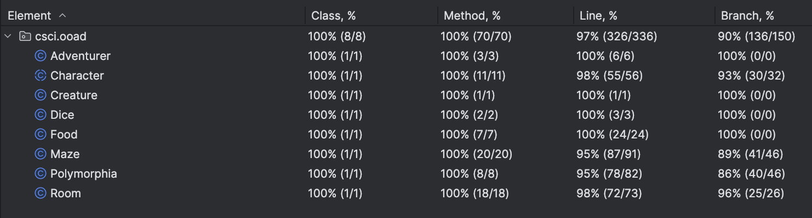

# CSCI 4448/5448 - Fall 2024 - Homework 3

## Team Members

Name: Sierra Reschke, Grace Ohlsen and Nolan Brady

## Java Version

openjdk 23 2024-09-17
OpenJDK Runtime Environment (build 23+37-2369)
OpenJDK 64-Bit Server VM (build 23+37-2369, mixed mode, sharing)

## Work Done

For this assignment, the main work was done in adjusting what we previously had to match the Homework 3 requirements.
We made the following adjustments:
* Got rid of any instantiation of non-trivial classes, including Character and Room
* Made more methods to include better encapsulation
* Altered the way that characters are moved to use room coordinates rather than looping through rooms
* Changed Character to be an abstract class rather than a regular class since there was no reason for an instance of Character, only Adventurer or Creature

We also added the following:
* Created a Maze class to encapsulate the collection of Rooms
* Used Maze to facilitate distribution of characters and foods
* Created a Food class to represent the Food object with name and healthGranted

Our main challenge was identifying the best way to encapsulate while also maintaining functionality of the game.

## EXAMPLES OF OOP PRINCIPLES
* Cohesion - see Polymorphism
* Encapsulation / Information Hiding - see Polymorphism
* Polymorphism - see Polymorphism
* Inheritance - see Polymorphism
* Dependency Injection - see Room

## Game Output
Please see the files `polymorhia_3x3_run_1.log` and `polymorhia_3x3_run_1.log` for the 3x3 maze game play.
Please see the files `polymorhia_2x2_run_1.log` and `polymorhia_2x2_run_1.log` for the 3x3 maze game play.

## Code Coverage
