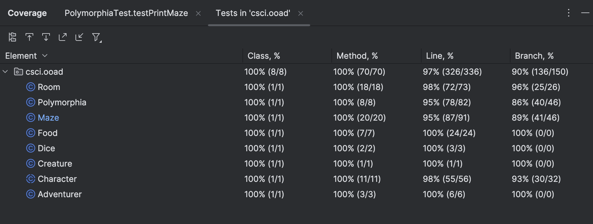

# CSCI 4448/5448 - Fall 2024 - Homework 3

## Team Members

Name: Sierra Reschke, Grace Ohlsen and Nolan Brady

## Work Done

For this assignment, the main work was done in adjusting what we previously had to match the Homework 3 requirements.
We made the following adjustments:
* Got rid of any instantiation of non-trivial classes, including Character and Room
* Made more methods to include better encapsulation
* Altered the way that characters are moved to use room coordinates rather than looping through rooms
* Changed Character to be an abstract class rather than a regular class since there was no reason for an instance of Character, only Adventurer or Creature

We also added the following:
* Created a Maze class to encapsulate the collection of Rooms
* Used Maze to facilitate distribution of characters and foods
* Created a Food class to represent the Food object with name and healthGranted

Our main challenge was identifying the best way to encapsulate while also maintaining functionality of the game.

## EXAMPLES OF OOP PRINCIPLES
* Cohesion - see Polymorphism
* Encapsulation / Information Hiding - see Polymorphism
* Polymorphism - see Polymorphism
* Inheritance - see Polymorphism
* Dependency Injection - see Room

## Code Coverage

## Game Output

### Output #1

8:06:17 PM: Executing ':csci.ooad.Main.main()'...

> Task :compileJava UP-TO-DATE
> Task :processResources UP-TO-DATE
> Task :classes UP-TO-DATE

> Task :csci.ooad.Main.main()
Starting play...Polymorphia Maze: turn 0
Room One:
Adventurers:
Creatures:
Food:

Room Two:
Adventurers: Bill(health: 5.0).
Creatures:
Food:

Room Three:
Adventurers: Ted(health: 5.0).
Creatures: Werewolf(health: 3.0).
Food: Bread, Pumpkin Pie

Room Four:
Adventurers:
Creatures: Vampire(health: 3.0).
Food:

Room Five:
Adventurers:
Creatures:
Food: Pork

Room Six:
Adventurers:
Creatures:
Food: Steak

Room Seven:
Adventurers:
Creatures: Ogre(health: 3.0). Troll(health: 3.0).
Food:

Room Eight:
Adventurers:
Creatures: Zombie(health: 3.0).
Food: Carrot, Cake

Room Nine:
Adventurers:
Creatures:
Food: Apple, Chicken, Mango, Pear

numAdventurersAlive2Polymorphia Maze: turn 1
Room One:
Adventurers:
Creatures:
Food:

Room Two:
Adventurers: Bill(health: 5.0).
Creatures:
Food:

Room Three:
Adventurers: Ted(health: 5.0).
Creatures: Werewolf(health: 3.0).
Food: Bread, Pumpkin Pie

Room Four:
Adventurers:
Creatures: Vampire(health: 3.0).
Food:

Room Five:
Adventurers:
Creatures:
Food: Pork

Room Six:
Adventurers:
Creatures:
Food: Steak

Room Seven:
Adventurers:
Creatures: Ogre(health: 3.0). Troll(health: 3.0).
Food:

Room Eight:
Adventurers:
Creatures: Zombie(health: 3.0).
Food: Carrot, Cake

Room Nine:
Adventurers:
Creatures:
Food: Apple, Chicken, Mango, Pear

Fight is a tie! Adventurer Ted(health: 5.0) fought Creature Werewolf (health: 3.0)
Bill(health: 5.0) moved from Room Two to Room One

Ted(health: 5.0) moved from Room Three to Room Two

Polymorphia Maze: turn 2
Room One:
Adventurers: Bill(health: 5.0).
Creatures:
Food:

Room Two:
Adventurers: Ted(health: 5.0).
Creatures:
Food:

Room Three:
Adventurers:
Creatures: Werewolf(health: 3.0).
Food: Bread, Pumpkin Pie

Room Four:
Adventurers:
Creatures: Vampire(health: 3.0).
Food:

Room Five:
Adventurers:
Creatures:
Food: Pork

Room Six:
Adventurers:
Creatures:
Food: Steak

Room Seven:
Adventurers:
Creatures: Ogre(health: 3.0). Troll(health: 3.0).
Food:

Room Eight:
Adventurers:
Creatures: Zombie(health: 3.0).
Food: Carrot, Cake

Room Nine:
Adventurers:
Creatures:
Food: Apple, Chicken, Mango, Pear

Bill(health: 5.0) moved from Room One to Room Two

Ted(health: 5.0) moved from Room Two to Room Three

Polymorphia Maze: turn 3
Room One:
Adventurers:
Creatures:
Food:

Room Two:
Adventurers: Bill(health: 5.0).
Creatures:
Food:

Room Three:
Adventurers: Ted(health: 5.0).
Creatures: Werewolf(health: 3.0).
Food: Bread, Pumpkin Pie

Room Four:
Adventurers:
Creatures: Vampire(health: 3.0).
Food:

Room Five:
Adventurers:
Creatures:
Food: Pork

Room Six:
Adventurers:
Creatures:
Food: Steak

Room Seven:
Adventurers:
Creatures: Ogre(health: 3.0). Troll(health: 3.0).
Food:

Room Eight:
Adventurers:
Creatures: Zombie(health: 3.0).
Food: Carrot, Cake

Room Nine:
Adventurers:
Creatures:
Food: Apple, Chicken, Mango, Pear

Fight is a tie! Adventurer Ted(health: 5.0) fought Creature Werewolf (health: 3.0)
Bill(health: 5.0) moved from Room Two to Room Five

Ted(health: 5.0) moved from Room Three to Room Six

Polymorphia Maze: turn 4
Room One:
Adventurers:
Creatures:
Food:

Room Two:
Adventurers:
Creatures:
Food:

Room Three:
Adventurers:
Creatures: Werewolf(health: 3.0).
Food: Bread, Pumpkin Pie

Room Four:
Adventurers:
Creatures: Vampire(health: 3.0).
Food:

Room Five:
Adventurers: Bill(health: 5.0).
Creatures:
Food: Pork

Room Six:
Adventurers: Ted(health: 5.0).
Creatures:
Food: Steak

Room Seven:
Adventurers:
Creatures: Ogre(health: 3.0). Troll(health: 3.0).
Food:

Room Eight:
Adventurers:
Creatures: Zombie(health: 3.0).
Food: Carrot, Cake

Room Nine:
Adventurers:
Creatures:
Food: Apple, Chicken, Mango, Pear

Bill(health: 5.0) ate a(n) Pork. Received 1 health point.
Ted(health: 5.0) ate a(n) Steak. Received 1 health point.
Bill(health: 6.0) moved from Room Five to Room Eight

Ted(health: 6.0) moved from Room Six to Room Three

Polymorphia Maze: turn 5
Room One:
Adventurers:
Creatures:
Food:

Room Two:
Adventurers:
Creatures:
Food:

Room Three:
Adventurers: Ted(health: 6.0).
Creatures: Werewolf(health: 3.0).
Food: Bread, Pumpkin Pie

Room Four:
Adventurers:
Creatures: Vampire(health: 3.0).
Food:

Room Five:
Adventurers:
Creatures:
Food:

Room Six:
Adventurers:
Creatures:
Food:

Room Seven:
Adventurers:
Creatures: Ogre(health: 3.0). Troll(health: 3.0).
Food:

Room Eight:
Adventurers: Bill(health: 6.0).
Creatures: Zombie(health: 3.0).
Food: Carrot, Cake

Room Nine:
Adventurers:
Creatures:
Food: Apple, Chicken, Mango, Pear

Creature Werewolf(health: -2.0) was killed.Adventurer wins the round. Creature takes 5 damage. Adventurer Ted(health: 6.0) fought Creature Werewolf (health: -2.0)
Adventurer wins the round. Creature takes 2 damage. Adventurer Bill(health: 6.0) fought Creature Zombie (health: 1.0)
Ted(health: 6.0) moved from Room Three to Room Six

Bill(health: 6.0) moved from Room Eight to Room Nine

Polymorphia Maze: turn 6
Room One:
Adventurers:
Creatures:
Food:

Room Two:
Adventurers:
Creatures:
Food:

Room Three:
Adventurers:
Creatures:
Food: Bread, Pumpkin Pie

Room Four:
Adventurers:
Creatures: Vampire(health: 3.0).
Food:

Room Five:
Adventurers:
Creatures:
Food:

Room Six:
Adventurers: Ted(health: 6.0).
Creatures:
Food:

Room Seven:
Adventurers:
Creatures: Ogre(health: 3.0). Troll(health: 3.0).
Food:

Room Eight:
Adventurers:
Creatures: Zombie(health: 1.0).
Food: Carrot, Cake

Room Nine:
Adventurers: Bill(health: 6.0).
Creatures:
Food: Apple, Chicken, Mango, Pear

Bill(health: 6.0) ate a(n) Apple. Received 1 health point.
Ted(health: 6.0) moved from Room Six to Room Five

Bill(health: 7.0) moved from Room Nine to Room Eight

Polymorphia Maze: turn 7
Room One:
Adventurers:
Creatures:
Food:

Room Two:
Adventurers:
Creatures:
Food:

Room Three:
Adventurers:
Creatures:
Food: Bread, Pumpkin Pie

Room Four:
Adventurers:
Creatures: Vampire(health: 3.0).
Food:

Room Five:
Adventurers: Ted(health: 6.0).
Creatures:
Food:

Room Six:
Adventurers:
Creatures:
Food:

Room Seven:
Adventurers:
Creatures: Ogre(health: 3.0). Troll(health: 3.0).
Food:

Room Eight:
Adventurers: Bill(health: 7.0).
Creatures: Zombie(health: 1.0).
Food: Carrot, Cake

Room Nine:
Adventurers:
Creatures:
Food: Chicken, Mango, Pear

Creature Zombie(health: -3.0) was killed.Adventurer wins the round. Creature takes 4 damage. Adventurer Bill(health: 7.0) fought Creature Zombie (health: -3.0)
Ted(health: 6.0) moved from Room Five to Room Six

Bill(health: 7.0) moved from Room Eight to Room Five

Polymorphia Maze: turn 8
Room One:
Adventurers:
Creatures:
Food:

Room Two:
Adventurers:
Creatures:
Food:

Room Three:
Adventurers:
Creatures:
Food: Bread, Pumpkin Pie

Room Four:
Adventurers:
Creatures: Vampire(health: 3.0).
Food:

Room Five:
Adventurers: Bill(health: 7.0).
Creatures:
Food:

Room Six:
Adventurers: Ted(health: 6.0).
Creatures:
Food:

Room Seven:
Adventurers:
Creatures: Ogre(health: 3.0). Troll(health: 3.0).
Food:

Room Eight:
Adventurers:
Creatures:
Food: Carrot, Cake

Room Nine:
Adventurers:
Creatures:
Food: Chicken, Mango, Pear

Bill(health: 7.0) moved from Room Five to Room Six

Ted(health: 6.0) moved from Room Six to Room Three

Polymorphia Maze: turn 9
Room One:
Adventurers:
Creatures:
Food:

Room Two:
Adventurers:
Creatures:
Food:

Room Three:
Adventurers: Ted(health: 6.0).
Creatures:
Food: Bread, Pumpkin Pie

Room Four:
Adventurers:
Creatures: Vampire(health: 3.0).
Food:

Room Five:
Adventurers:
Creatures:
Food:

Room Six:
Adventurers: Bill(health: 7.0).
Creatures:
Food:

Room Seven:
Adventurers:
Creatures: Ogre(health: 3.0). Troll(health: 3.0).
Food:

Room Eight:
Adventurers:
Creatures:
Food: Carrot, Cake

Room Nine:
Adventurers:
Creatures:
Food: Chicken, Mango, Pear

Ted(health: 6.0) ate a(n) Bread. Received 1 health point.
Ted(health: 7.0) moved from Room Three to Room Six

Bill(health: 7.0) moved from Room Six to Room Three

Polymorphia Maze: turn 10
Room One:
Adventurers:
Creatures:
Food:

Room Two:
Adventurers:
Creatures:
Food:

Room Three:
Adventurers: Bill(health: 7.0).
Creatures:
Food: Pumpkin Pie

Room Four:
Adventurers:
Creatures: Vampire(health: 3.0).
Food:

Room Five:
Adventurers:
Creatures:
Food:

Room Six:
Adventurers: Ted(health: 7.0).
Creatures:
Food:

Room Seven:
Adventurers:
Creatures: Ogre(health: 3.0). Troll(health: 3.0).
Food:

Room Eight:
Adventurers:
Creatures:
Food: Carrot, Cake

Room Nine:
Adventurers:
Creatures:
Food: Chicken, Mango, Pear

Bill(health: 7.0) ate a(n) Pumpkin Pie. Received 1 health point.
Bill(health: 8.0) moved from Room Three to Room Two

Ted(health: 7.0) moved from Room Six to Room Three

Polymorphia Maze: turn 11
Room One:
Adventurers:
Creatures:
Food:

Room Two:
Adventurers: Bill(health: 8.0).
Creatures:
Food:

Room Three:
Adventurers: Ted(health: 7.0).
Creatures:
Food:

Room Four:
Adventurers:
Creatures: Vampire(health: 3.0).
Food:

Room Five:
Adventurers:
Creatures:
Food:

Room Six:
Adventurers:
Creatures:
Food:

Room Seven:
Adventurers:
Creatures: Ogre(health: 3.0). Troll(health: 3.0).
Food:

Room Eight:
Adventurers:
Creatures:
Food: Carrot, Cake

Room Nine:
Adventurers:
Creatures:
Food: Chicken, Mango, Pear

Bill(health: 8.0) moved from Room Two to Room Five

Ted(health: 7.0) moved from Room Three to Room Two

Polymorphia Maze: turn 12
Room One:
Adventurers:
Creatures:
Food:

Room Two:
Adventurers: Ted(health: 7.0).
Creatures:
Food:

Room Three:
Adventurers:
Creatures:
Food:

Room Four:
Adventurers:
Creatures: Vampire(health: 3.0).
Food:

Room Five:
Adventurers: Bill(health: 8.0).
Creatures:
Food:

Room Six:
Adventurers:
Creatures:
Food:

Room Seven:
Adventurers:
Creatures: Ogre(health: 3.0). Troll(health: 3.0).
Food:

Room Eight:
Adventurers:
Creatures:
Food: Carrot, Cake

Room Nine:
Adventurers:
Creatures:
Food: Chicken, Mango, Pear

Ted(health: 7.0) moved from Room Two to Room One

Bill(health: 8.0) moved from Room Five to Room Two

Polymorphia Maze: turn 13
Room One:
Adventurers: Ted(health: 7.0).
Creatures:
Food:

Room Two:
Adventurers: Bill(health: 8.0).
Creatures:
Food:

Room Three:
Adventurers:
Creatures:
Food:

Room Four:
Adventurers:
Creatures: Vampire(health: 3.0).
Food:

Room Five:
Adventurers:
Creatures:
Food:

Room Six:
Adventurers:
Creatures:
Food:

Room Seven:
Adventurers:
Creatures: Ogre(health: 3.0). Troll(health: 3.0).
Food:

Room Eight:
Adventurers:
Creatures:
Food: Carrot, Cake

Room Nine:
Adventurers:
Creatures:
Food: Chicken, Mango, Pear

Ted(health: 7.0) moved from Room One to Room Four

Bill(health: 8.0) moved from Room Two to Room Three

Polymorphia Maze: turn 14
Room One:
Adventurers:
Creatures:
Food:

Room Two:
Adventurers:
Creatures:
Food:

Room Three:
Adventurers: Bill(health: 8.0).
Creatures:
Food:

Room Four:
Adventurers: Ted(health: 7.0).
Creatures: Vampire(health: 3.0).
Food:

Room Five:
Adventurers:
Creatures:
Food:

Room Six:
Adventurers:
Creatures:
Food:

Room Seven:
Adventurers:
Creatures: Ogre(health: 3.0). Troll(health: 3.0).
Food:

Room Eight:
Adventurers:
Creatures:
Food: Carrot, Cake

Room Nine:
Adventurers:
Creatures:
Food: Chicken, Mango, Pear

Creature wins the round. Adventurer takes 2 damage. Adventurer Ted(health: 5.0) fought Creature Vampire (health: 3.0)
Bill(health: 8.0) moved from Room Three to Room Six

Ted(health: 5.0) moved from Room Four to Room One

Polymorphia Maze: turn 15
Room One:
Adventurers: Ted(health: 5.0).
Creatures:
Food:

Room Two:
Adventurers:
Creatures:
Food:

Room Three:
Adventurers:
Creatures:
Food:

Room Four:
Adventurers:
Creatures: Vampire(health: 3.0).
Food:

Room Five:
Adventurers:
Creatures:
Food:

Room Six:
Adventurers: Bill(health: 8.0).
Creatures:
Food:

Room Seven:
Adventurers:
Creatures: Ogre(health: 3.0). Troll(health: 3.0).
Food:

Room Eight:
Adventurers:
Creatures:
Food: Carrot, Cake

Room Nine:
Adventurers:
Creatures:
Food: Chicken, Mango, Pear

Ted(health: 5.0) moved from Room One to Room Two

Bill(health: 8.0) moved from Room Six to Room Nine

Polymorphia Maze: turn 16
Room One:
Adventurers:
Creatures:
Food:

Room Two:
Adventurers: Ted(health: 5.0).
Creatures:
Food:

Room Three:
Adventurers:
Creatures:
Food:

Room Four:
Adventurers:
Creatures: Vampire(health: 3.0).
Food:

Room Five:
Adventurers:
Creatures:
Food:

Room Six:
Adventurers:
Creatures:
Food:

Room Seven:
Adventurers:
Creatures: Ogre(health: 3.0). Troll(health: 3.0).
Food:

Room Eight:
Adventurers:
Creatures:
Food: Carrot, Cake

Room Nine:
Adventurers: Bill(health: 8.0).
Creatures:
Food: Chicken, Mango, Pear

Bill(health: 8.0) ate a(n) Chicken. Received 1 health point.
Ted(health: 5.0) moved from Room Two to Room One

Bill(health: 9.0) moved from Room Nine to Room Eight

Polymorphia Maze: turn 17
Room One:
Adventurers: Ted(health: 5.0).
Creatures:
Food:

Room Two:
Adventurers:
Creatures:
Food:

Room Three:
Adventurers:
Creatures:
Food:

Room Four:
Adventurers:
Creatures: Vampire(health: 3.0).
Food:

Room Five:
Adventurers:
Creatures:
Food:

Room Six:
Adventurers:
Creatures:
Food:

Room Seven:
Adventurers:
Creatures: Ogre(health: 3.0). Troll(health: 3.0).
Food:

Room Eight:
Adventurers: Bill(health: 9.0).
Creatures:
Food: Carrot, Cake

Room Nine:
Adventurers:
Creatures:
Food: Mango, Pear

Bill(health: 9.0) ate a(n) Carrot. Received 1 health point.
Ted(health: 5.0) moved from Room One to Room Four

Bill(health: 10.0) moved from Room Eight to Room Nine

Polymorphia Maze: turn 18
Room One:
Adventurers:
Creatures:
Food:

Room Two:
Adventurers:
Creatures:
Food:

Room Three:
Adventurers:
Creatures:
Food:

Room Four:
Adventurers: Ted(health: 5.0).
Creatures: Vampire(health: 3.0).
Food:

Room Five:
Adventurers:
Creatures:
Food:

Room Six:
Adventurers:
Creatures:
Food:

Room Seven:
Adventurers:
Creatures: Ogre(health: 3.0). Troll(health: 3.0).
Food:

Room Eight:
Adventurers:
Creatures:
Food: Cake

Room Nine:
Adventurers: Bill(health: 10.0).
Creatures:
Food: Mango, Pear

Creature Vampire(health: 0.0) was killed.Adventurer wins the round. Creature takes 3 damage. Adventurer Ted(health: 5.0) fought Creature Vampire (health: 0.0)
Bill(health: 10.0) ate a(n) Mango. Received 1 health point.
Ted(health: 5.0) moved from Room Four to Room One

Bill(health: 11.0) moved from Room Nine to Room Eight

Polymorphia Maze: turn 19
Room One:
Adventurers: Ted(health: 5.0).
Creatures:
Food:

Room Two:
Adventurers:
Creatures:
Food:

Room Three:
Adventurers:
Creatures:
Food:

Room Four:
Adventurers:
Creatures:
Food:

Room Five:
Adventurers:
Creatures:
Food:

Room Six:
Adventurers:
Creatures:
Food:

Room Seven:
Adventurers:
Creatures: Ogre(health: 3.0). Troll(health: 3.0).
Food:

Room Eight:
Adventurers: Bill(health: 11.0).
Creatures:
Food: Cake

Room Nine:
Adventurers:
Creatures:
Food: Pear

Bill(health: 11.0) ate a(n) Cake. Received 1 health point.
Ted(health: 5.0) moved from Room One to Room Four

Bill(health: 12.0) moved from Room Eight to Room Nine

Polymorphia Maze: turn 20
Room One:
Adventurers:
Creatures:
Food:

Room Two:
Adventurers:
Creatures:
Food:

Room Three:
Adventurers:
Creatures:
Food:

Room Four:
Adventurers: Ted(health: 5.0).
Creatures:
Food:

Room Five:
Adventurers:
Creatures:
Food:

Room Six:
Adventurers:
Creatures:
Food:

Room Seven:
Adventurers:
Creatures: Ogre(health: 3.0). Troll(health: 3.0).
Food:

Room Eight:
Adventurers:
Creatures:
Food:

Room Nine:
Adventurers: Bill(health: 12.0).
Creatures:
Food: Pear

Bill(health: 12.0) ate a(n) Pear. Received 1 health point.
Ted(health: 5.0) moved from Room Four to Room Seven

Bill(health: 13.0) moved from Room Nine to Room Six

Polymorphia Maze: turn 21
Room One:
Adventurers:
Creatures:
Food:

Room Two:
Adventurers:
Creatures:
Food:

Room Three:
Adventurers:
Creatures:
Food:

Room Four:
Adventurers:
Creatures:
Food:

Room Five:
Adventurers:
Creatures:
Food:

Room Six:
Adventurers: Bill(health: 13.0).
Creatures:
Food:

Room Seven:
Adventurers: Ted(health: 5.0).
Creatures: Ogre(health: 3.0). Troll(health: 3.0).
Food:

Room Eight:
Adventurers:
Creatures:
Food:

Room Nine:
Adventurers:
Creatures:
Food:

Creature wins the round. Adventurer takes 2 damage. Adventurer Ted(health: 3.0) fought Creature Ogre (health: 3.0)
Bill(health: 13.0) moved from Room Six to Room Nine

Ted(health: 3.0) moved from Room Seven to Room Four

Polymorphia Maze: turn 22
Room One:
Adventurers:
Creatures:
Food:

Room Two:
Adventurers:
Creatures:
Food:

Room Three:
Adventurers:
Creatures:
Food:

Room Four:
Adventurers: Ted(health: 3.0).
Creatures:
Food:

Room Five:
Adventurers:
Creatures:
Food:

Room Six:
Adventurers:
Creatures:
Food:

Room Seven:
Adventurers:
Creatures: Ogre(health: 3.0). Troll(health: 3.0).
Food:

Room Eight:
Adventurers:
Creatures:
Food:

Room Nine:
Adventurers: Bill(health: 13.0).
Creatures:
Food:

Ted(health: 3.0) moved from Room Four to Room One

Bill(health: 13.0) moved from Room Nine to Room Six

Polymorphia Maze: turn 23
Room One:
Adventurers: Ted(health: 3.0).
Creatures:
Food:

Room Two:
Adventurers:
Creatures:
Food:

Room Three:
Adventurers:
Creatures:
Food:

Room Four:
Adventurers:
Creatures:
Food:

Room Five:
Adventurers:
Creatures:
Food:

Room Six:
Adventurers: Bill(health: 13.0).
Creatures:
Food:

Room Seven:
Adventurers:
Creatures: Ogre(health: 3.0). Troll(health: 3.0).
Food:

Room Eight:
Adventurers:
Creatures:
Food:

Room Nine:
Adventurers:
Creatures:
Food:

Ted(health: 3.0) moved from Room One to Room Four

Bill(health: 13.0) moved from Room Six to Room Nine

Polymorphia Maze: turn 24
Room One:
Adventurers:
Creatures:
Food:

Room Two:
Adventurers:
Creatures:
Food:

Room Three:
Adventurers:
Creatures:
Food:

Room Four:
Adventurers: Ted(health: 3.0).
Creatures:
Food:

Room Five:
Adventurers:
Creatures:
Food:

Room Six:
Adventurers:
Creatures:
Food:

Room Seven:
Adventurers:
Creatures: Ogre(health: 3.0). Troll(health: 3.0).
Food:

Room Eight:
Adventurers:
Creatures:
Food:

Room Nine:
Adventurers: Bill(health: 13.0).
Creatures:
Food:

Ted(health: 3.0) moved from Room Four to Room Five

Bill(health: 13.0) moved from Room Nine to Room Eight

Polymorphia Maze: turn 25
Room One:
Adventurers:
Creatures:
Food:

Room Two:
Adventurers:
Creatures:
Food:

Room Three:
Adventurers:
Creatures:
Food:

Room Four:
Adventurers:
Creatures:
Food:

Room Five:
Adventurers: Ted(health: 3.0).
Creatures:
Food:

Room Six:
Adventurers:
Creatures:
Food:

Room Seven:
Adventurers:
Creatures: Ogre(health: 3.0). Troll(health: 3.0).
Food:

Room Eight:
Adventurers: Bill(health: 13.0).
Creatures:
Food:

Room Nine:
Adventurers:
Creatures:
Food:

Ted(health: 3.0) moved from Room Five to Room Four

Bill(health: 13.0) moved from Room Eight to Room Seven

Polymorphia Maze: turn 26
Room One:
Adventurers:
Creatures:
Food:

Room Two:
Adventurers:
Creatures:
Food:

Room Three:
Adventurers:
Creatures:
Food:

Room Four:
Adventurers: Ted(health: 3.0).
Creatures:
Food:

Room Five:
Adventurers:
Creatures:
Food:

Room Six:
Adventurers:
Creatures:
Food:

Room Seven:
Adventurers: Bill(health: 13.0).
Creatures: Ogre(health: 3.0). Troll(health: 3.0).
Food:

Room Eight:
Adventurers:
Creatures:
Food:

Room Nine:
Adventurers:
Creatures:
Food:

Adventurer wins the round. Creature takes 2 damage. Adventurer Bill(health: 13.0) fought Creature Ogre (health: 1.0)
Ted(health: 3.0) moved from Room Four to Room Five

Bill(health: 13.0) moved from Room Seven to Room Four

Polymorphia Maze: turn 27
Room One:
Adventurers:
Creatures:
Food:

Room Two:
Adventurers:
Creatures:
Food:

Room Three:
Adventurers:
Creatures:
Food:

Room Four:
Adventurers: Bill(health: 13.0).
Creatures:
Food:

Room Five:
Adventurers: Ted(health: 3.0).
Creatures:
Food:

Room Six:
Adventurers:
Creatures:
Food:

Room Seven:
Adventurers:
Creatures: Ogre(health: 1.0). Troll(health: 3.0).
Food:

Room Eight:
Adventurers:
Creatures:
Food:

Room Nine:
Adventurers:
Creatures:
Food:

Bill(health: 13.0) moved from Room Four to Room Five

Ted(health: 3.0) moved from Room Five to Room Four

Polymorphia Maze: turn 28
Room One:
Adventurers:
Creatures:
Food:

Room Two:
Adventurers:
Creatures:
Food:

Room Three:
Adventurers:
Creatures:
Food:

Room Four:
Adventurers: Ted(health: 3.0).
Creatures:
Food:

Room Five:
Adventurers: Bill(health: 13.0).
Creatures:
Food:

Room Six:
Adventurers:
Creatures:
Food:

Room Seven:
Adventurers:
Creatures: Ogre(health: 1.0). Troll(health: 3.0).
Food:

Room Eight:
Adventurers:
Creatures:
Food:

Room Nine:
Adventurers:
Creatures:
Food:

Ted(health: 3.0) moved from Room Four to Room Seven

Bill(health: 13.0) moved from Room Five to Room Two

Polymorphia Maze: turn 29
Room One:
Adventurers:
Creatures:
Food:

Room Two:
Adventurers: Bill(health: 13.0).
Creatures:
Food:

Room Three:
Adventurers:
Creatures:
Food:

Room Four:
Adventurers:
Creatures:
Food:

Room Five:
Adventurers:
Creatures:
Food:

Room Six:
Adventurers:
Creatures:
Food:

Room Seven:
Adventurers: Ted(health: 3.0).
Creatures: Ogre(health: 1.0). Troll(health: 3.0).
Food:

Room Eight:
Adventurers:
Creatures:
Food:

Room Nine:
Adventurers:
Creatures:
Food:

Creature Ogre(health: -1.0) was killed.Adventurer wins the round. Creature takes 2 damage. Adventurer Ted(health: 3.0) fought Creature Ogre (health: -1.0)
Bill(health: 13.0) moved from Room Two to Room Three

Ted(health: 3.0) moved from Room Seven to Room Four

Polymorphia Maze: turn 30
Room One:
Adventurers:
Creatures:
Food:

Room Two:
Adventurers:
Creatures:
Food:

Room Three:
Adventurers: Bill(health: 13.0).
Creatures:
Food:

Room Four:
Adventurers: Ted(health: 3.0).
Creatures:
Food:

Room Five:
Adventurers:
Creatures:
Food:

Room Six:
Adventurers:
Creatures:
Food:

Room Seven:
Adventurers:
Creatures: Troll(health: 3.0).
Food:

Room Eight:
Adventurers:
Creatures:
Food:

Room Nine:
Adventurers:
Creatures:
Food:

Bill(health: 13.0) moved from Room Three to Room Six

Ted(health: 3.0) moved from Room Four to Room Seven

Polymorphia Maze: turn 31
Room One:
Adventurers:
Creatures:
Food:

Room Two:
Adventurers:
Creatures:
Food:

Room Three:
Adventurers:
Creatures:
Food:

Room Four:
Adventurers:
Creatures:
Food:

Room Five:
Adventurers:
Creatures:
Food:

Room Six:
Adventurers: Bill(health: 13.0).
Creatures:
Food:

Room Seven:
Adventurers: Ted(health: 3.0).
Creatures: Troll(health: 3.0).
Food:

Room Eight:
Adventurers:
Creatures:
Food:

Room Nine:
Adventurers:
Creatures:
Food:

Adventurer Ted(health: 0.0) was killed.Creature wins the round. Adventurer takes 3 damage. Adventurer Ted(health: 0.0) fought Creature Troll (health: 3.0)
Bill(health: 13.0) moved from Room Six to Room Nine

Polymorphia Maze: turn 32
Room One:
Adventurers:
Creatures:
Food:

Room Two:
Adventurers:
Creatures:
Food:

Room Three:
Adventurers:
Creatures:
Food:

Room Four:
Adventurers:
Creatures:
Food:

Room Five:
Adventurers:
Creatures:
Food:

Room Six:
Adventurers:
Creatures:
Food:

Room Seven:
Adventurers:
Creatures: Troll(health: 3.0).
Food:

Room Eight:
Adventurers:
Creatures:
Food:

Room Nine:
Adventurers: Bill(health: 13.0).
Creatures:
Food:

Bill(health: 13.0) moved from Room Nine to Room Eight

Polymorphia Maze: turn 33
Room One:
Adventurers:
Creatures:
Food:

Room Two:
Adventurers:
Creatures:
Food:

Room Three:
Adventurers:
Creatures:
Food:

Room Four:
Adventurers:
Creatures:
Food:

Room Five:
Adventurers:
Creatures:
Food:

Room Six:
Adventurers:
Creatures:
Food:

Room Seven:
Adventurers:
Creatures: Troll(health: 3.0).
Food:

Room Eight:
Adventurers: Bill(health: 13.0).
Creatures:
Food:

Room Nine:
Adventurers:
Creatures:
Food:

Bill(health: 13.0) moved from Room Eight to Room Nine

Polymorphia Maze: turn 34
Room One:
Adventurers:
Creatures:
Food:

Room Two:
Adventurers:
Creatures:
Food:

Room Three:
Adventurers:
Creatures:
Food:

Room Four:
Adventurers:
Creatures:
Food:

Room Five:
Adventurers:
Creatures:
Food:

Room Six:
Adventurers:
Creatures:
Food:

Room Seven:
Adventurers:
Creatures: Troll(health: 3.0).
Food:

Room Eight:
Adventurers:
Creatures:
Food:

Room Nine:
Adventurers: Bill(health: 13.0).
Creatures:
Food:

Bill(health: 13.0) moved from Room Nine to Room Eight

Polymorphia Maze: turn 35
Room One:
Adventurers:
Creatures:
Food:

Room Two:
Adventurers:
Creatures:
Food:

Room Three:
Adventurers:
Creatures:
Food:

Room Four:
Adventurers:
Creatures:
Food:

Room Five:
Adventurers:
Creatures:
Food:

Room Six:
Adventurers:
Creatures:
Food:

Room Seven:
Adventurers:
Creatures: Troll(health: 3.0).
Food:

Room Eight:
Adventurers: Bill(health: 13.0).
Creatures:
Food:

Room Nine:
Adventurers:
Creatures:
Food:

Bill(health: 13.0) moved from Room Eight to Room Five

Polymorphia Maze: turn 36
Room One:
Adventurers:
Creatures:
Food:

Room Two:
Adventurers:
Creatures:
Food:

Room Three:
Adventurers:
Creatures:
Food:

Room Four:
Adventurers:
Creatures:
Food:

Room Five:
Adventurers: Bill(health: 13.0).
Creatures:
Food:

Room Six:
Adventurers:
Creatures:
Food:

Room Seven:
Adventurers:
Creatures: Troll(health: 3.0).
Food:

Room Eight:
Adventurers:
Creatures:
Food:

Room Nine:
Adventurers:
Creatures:
Food:

Bill(health: 13.0) moved from Room Five to Room Eight

Polymorphia Maze: turn 37
Room One:
Adventurers:
Creatures:
Food:

Room Two:
Adventurers:
Creatures:
Food:

Room Three:
Adventurers:
Creatures:
Food:

Room Four:
Adventurers:
Creatures:
Food:

Room Five:
Adventurers:
Creatures:
Food:

Room Six:
Adventurers:
Creatures:
Food:

Room Seven:
Adventurers:
Creatures: Troll(health: 3.0).
Food:

Room Eight:
Adventurers: Bill(health: 13.0).
Creatures:
Food:

Room Nine:
Adventurers:
Creatures:
Food:

Bill(health: 13.0) moved from Room Eight to Room Nine

Polymorphia Maze: turn 38
Room One:
Adventurers:
Creatures:
Food:

Room Two:
Adventurers:
Creatures:
Food:

Room Three:
Adventurers:
Creatures:
Food:

Room Four:
Adventurers:
Creatures:
Food:

Room Five:
Adventurers:
Creatures:
Food:

Room Six:
Adventurers:
Creatures:
Food:

Room Seven:
Adventurers:
Creatures: Troll(health: 3.0).
Food:

Room Eight:
Adventurers:
Creatures:
Food:

Room Nine:
Adventurers: Bill(health: 13.0).
Creatures:
Food:

Bill(health: 13.0) moved from Room Nine to Room Eight

Polymorphia Maze: turn 39
Room One:
Adventurers:
Creatures:
Food:

Room Two:
Adventurers:
Creatures:
Food:

Room Three:
Adventurers:
Creatures:
Food:

Room Four:
Adventurers:
Creatures:
Food:

Room Five:
Adventurers:
Creatures:
Food:

Room Six:
Adventurers:
Creatures:
Food:

Room Seven:
Adventurers:
Creatures: Troll(health: 3.0).
Food:

Room Eight:
Adventurers: Bill(health: 13.0).
Creatures:
Food:

Room Nine:
Adventurers:
Creatures:
Food:

Bill(health: 13.0) moved from Room Eight to Room Nine

Polymorphia Maze: turn 40
Room One:
Adventurers:
Creatures:
Food:

Room Two:
Adventurers:
Creatures:
Food:

Room Three:
Adventurers:
Creatures:
Food:

Room Four:
Adventurers:
Creatures:
Food:

Room Five:
Adventurers:
Creatures:
Food:

Room Six:
Adventurers:
Creatures:
Food:

Room Seven:
Adventurers:
Creatures: Troll(health: 3.0).
Food:

Room Eight:
Adventurers:
Creatures:
Food:

Room Nine:
Adventurers: Bill(health: 13.0).
Creatures:
Food:

Bill(health: 13.0) moved from Room Nine to Room Six

Polymorphia Maze: turn 41
Room One:
Adventurers:
Creatures:
Food:

Room Two:
Adventurers:
Creatures:
Food:

Room Three:
Adventurers:
Creatures:
Food:

Room Four:
Adventurers:
Creatures:
Food:

Room Five:
Adventurers:
Creatures:
Food:

Room Six:
Adventurers: Bill(health: 13.0).
Creatures:
Food:

Room Seven:
Adventurers:
Creatures: Troll(health: 3.0).
Food:

Room Eight:
Adventurers:
Creatures:
Food:

Room Nine:
Adventurers:
Creatures:
Food:

Bill(health: 13.0) moved from Room Six to Room Three

Polymorphia Maze: turn 42
Room One:
Adventurers:
Creatures:
Food:

Room Two:
Adventurers:
Creatures:
Food:

Room Three:
Adventurers: Bill(health: 13.0).
Creatures:
Food:

Room Four:
Adventurers:
Creatures:
Food:

Room Five:
Adventurers:
Creatures:
Food:

Room Six:
Adventurers:
Creatures:
Food:

Room Seven:
Adventurers:
Creatures: Troll(health: 3.0).
Food:

Room Eight:
Adventurers:
Creatures:
Food:

Room Nine:
Adventurers:
Creatures:
Food:

Bill(health: 13.0) moved from Room Three to Room Two

Polymorphia Maze: turn 43
Room One:
Adventurers:
Creatures:
Food:

Room Two:
Adventurers: Bill(health: 13.0).
Creatures:
Food:

Room Three:
Adventurers:
Creatures:
Food:

Room Four:
Adventurers:
Creatures:
Food:

Room Five:
Adventurers:
Creatures:
Food:

Room Six:
Adventurers:
Creatures:
Food:

Room Seven:
Adventurers:
Creatures: Troll(health: 3.0).
Food:

Room Eight:
Adventurers:
Creatures:
Food:

Room Nine:
Adventurers:
Creatures:
Food:

Bill(health: 13.0) moved from Room Two to Room Five

Polymorphia Maze: turn 44
Room One:
Adventurers:
Creatures:
Food:

Room Two:
Adventurers:
Creatures:
Food:

Room Three:
Adventurers:
Creatures:
Food:

Room Four:
Adventurers:
Creatures:
Food:

Room Five:
Adventurers: Bill(health: 13.0).
Creatures:
Food:

Room Six:
Adventurers:
Creatures:
Food:

Room Seven:
Adventurers:
Creatures: Troll(health: 3.0).
Food:

Room Eight:
Adventurers:
Creatures:
Food:

Room Nine:
Adventurers:
Creatures:
Food:

Bill(health: 13.0) moved from Room Five to Room Four

Polymorphia Maze: turn 45
Room One:
Adventurers:
Creatures:
Food:

Room Two:
Adventurers:
Creatures:
Food:

Room Three:
Adventurers:
Creatures:
Food:

Room Four:
Adventurers: Bill(health: 13.0).
Creatures:
Food:

Room Five:
Adventurers:
Creatures:
Food:

Room Six:
Adventurers:
Creatures:
Food:

Room Seven:
Adventurers:
Creatures: Troll(health: 3.0).
Food:

Room Eight:
Adventurers:
Creatures:
Food:

Room Nine:
Adventurers:
Creatures:
Food:

Bill(health: 13.0) moved from Room Four to Room Seven

Polymorphia Maze: turn 46
Room One:
Adventurers:
Creatures:
Food:

Room Two:
Adventurers:
Creatures:
Food:

Room Three:
Adventurers:
Creatures:
Food:

Room Four:
Adventurers:
Creatures:
Food:

Room Five:
Adventurers:
Creatures:
Food:

Room Six:
Adventurers:
Creatures:
Food:

Room Seven:
Adventurers: Bill(health: 13.0).
Creatures: Troll(health: 3.0).
Food:

Room Eight:
Adventurers:
Creatures:
Food:

Room Nine:
Adventurers:
Creatures:
Food:

Creature wins the round. Adventurer takes 1 damage. Adventurer Bill(health: 12.0) fought Creature Troll (health: 3.0)
Bill(health: 12.0) moved from Room Seven to Room Four

Polymorphia Maze: turn 47
Room One:
Adventurers:
Creatures:
Food:

Room Two:
Adventurers:
Creatures:
Food:

Room Three:
Adventurers:
Creatures:
Food:

Room Four:
Adventurers: Bill(health: 12.0).
Creatures:
Food:

Room Five:
Adventurers:
Creatures:
Food:

Room Six:
Adventurers:
Creatures:
Food:

Room Seven:
Adventurers:
Creatures: Troll(health: 3.0).
Food:

Room Eight:
Adventurers:
Creatures:
Food:

Room Nine:
Adventurers:
Creatures:
Food:

Bill(health: 12.0) moved from Room Four to Room One

Polymorphia Maze: turn 48
Room One:
Adventurers: Bill(health: 12.0).
Creatures:
Food:

Room Two:
Adventurers:
Creatures:
Food:

Room Three:
Adventurers:
Creatures:
Food:

Room Four:
Adventurers:
Creatures:
Food:

Room Five:
Adventurers:
Creatures:
Food:

Room Six:
Adventurers:
Creatures:
Food:

Room Seven:
Adventurers:
Creatures: Troll(health: 3.0).
Food:

Room Eight:
Adventurers:
Creatures:
Food:

Room Nine:
Adventurers:
Creatures:
Food:

Bill(health: 12.0) moved from Room One to Room Four

Polymorphia Maze: turn 49
Room One:
Adventurers:
Creatures:
Food:

Room Two:
Adventurers:
Creatures:
Food:

Room Three:
Adventurers:
Creatures:
Food:

Room Four:
Adventurers: Bill(health: 12.0).
Creatures:
Food:

Room Five:
Adventurers:
Creatures:
Food:

Room Six:
Adventurers:
Creatures:
Food:

Room Seven:
Adventurers:
Creatures: Troll(health: 3.0).
Food:

Room Eight:
Adventurers:
Creatures:
Food:

Room Nine:
Adventurers:
Creatures:
Food:

Bill(health: 12.0) moved from Room Four to Room Seven

Polymorphia Maze: turn 50
Room One:
Adventurers:
Creatures:
Food:

Room Two:
Adventurers:
Creatures:
Food:

Room Three:
Adventurers:
Creatures:
Food:

Room Four:
Adventurers:
Creatures:
Food:

Room Five:
Adventurers:
Creatures:
Food:

Room Six:
Adventurers:
Creatures:
Food:

Room Seven:
Adventurers: Bill(health: 12.0).
Creatures: Troll(health: 3.0).
Food:

Room Eight:
Adventurers:
Creatures:
Food:

Room Nine:
Adventurers:
Creatures:
Food:

Fight is a tie! Adventurer Bill(health: 12.0) fought Creature Troll (health: 3.0)
Bill(health: 12.0) moved from Room Seven to Room Eight

Polymorphia Maze: turn 51
Room One:
Adventurers:
Creatures:
Food:

Room Two:
Adventurers:
Creatures:
Food:

Room Three:
Adventurers:
Creatures:
Food:

Room Four:
Adventurers:
Creatures:
Food:

Room Five:
Adventurers:
Creatures:
Food:

Room Six:
Adventurers:
Creatures:
Food:

Room Seven:
Adventurers:
Creatures: Troll(health: 3.0).
Food:

Room Eight:
Adventurers: Bill(health: 12.0).
Creatures:
Food:

Room Nine:
Adventurers:
Creatures:
Food:

Bill(health: 12.0) moved from Room Eight to Room Seven

Polymorphia Maze: turn 52
Room One:
Adventurers:
Creatures:
Food:

Room Two:
Adventurers:
Creatures:
Food:

Room Three:
Adventurers:
Creatures:
Food:

Room Four:
Adventurers:
Creatures:
Food:

Room Five:
Adventurers:
Creatures:
Food:

Room Six:
Adventurers:
Creatures:
Food:

Room Seven:
Adventurers: Bill(health: 12.0).
Creatures: Troll(health: 3.0).
Food:

Room Eight:
Adventurers:
Creatures:
Food:

Room Nine:
Adventurers:
Creatures:
Food:

Creature wins the round. Adventurer takes 5 damage. Adventurer Bill(health: 7.0) fought Creature Troll (health: 3.0)
Bill(health: 7.0) moved from Room Seven to Room Eight

Polymorphia Maze: turn 53
Room One:
Adventurers:
Creatures:
Food:

Room Two:
Adventurers:
Creatures:
Food:

Room Three:
Adventurers:
Creatures:
Food:

Room Four:
Adventurers:
Creatures:
Food:

Room Five:
Adventurers:
Creatures:
Food:

Room Six:
Adventurers:
Creatures:
Food:

Room Seven:
Adventurers:
Creatures: Troll(health: 3.0).
Food:

Room Eight:
Adventurers: Bill(health: 7.0).
Creatures:
Food:

Room Nine:
Adventurers:
Creatures:
Food:

Bill(health: 7.0) moved from Room Eight to Room Nine

Polymorphia Maze: turn 54
Room One:
Adventurers:
Creatures:
Food:

Room Two:
Adventurers:
Creatures:
Food:

Room Three:
Adventurers:
Creatures:
Food:

Room Four:
Adventurers:
Creatures:
Food:

Room Five:
Adventurers:
Creatures:
Food:

Room Six:
Adventurers:
Creatures:
Food:

Room Seven:
Adventurers:
Creatures: Troll(health: 3.0).
Food:

Room Eight:
Adventurers:
Creatures:
Food:

Room Nine:
Adventurers: Bill(health: 7.0).
Creatures:
Food:

Bill(health: 7.0) moved from Room Nine to Room Six

Polymorphia Maze: turn 55
Room One:
Adventurers:
Creatures:
Food:

Room Two:
Adventurers:
Creatures:
Food:

Room Three:
Adventurers:
Creatures:
Food:

Room Four:
Adventurers:
Creatures:
Food:

Room Five:
Adventurers:
Creatures:
Food:

Room Six:
Adventurers: Bill(health: 7.0).
Creatures:
Food:

Room Seven:
Adventurers:
Creatures: Troll(health: 3.0).
Food:

Room Eight:
Adventurers:
Creatures:
Food:

Room Nine:
Adventurers:
Creatures:
Food:

Bill(health: 7.0) moved from Room Six to Room Three

Polymorphia Maze: turn 56
Room One:
Adventurers:
Creatures:
Food:

Room Two:
Adventurers:
Creatures:
Food:

Room Three:
Adventurers: Bill(health: 7.0).
Creatures:
Food:

Room Four:
Adventurers:
Creatures:
Food:

Room Five:
Adventurers:
Creatures:
Food:

Room Six:
Adventurers:
Creatures:
Food:

Room Seven:
Adventurers:
Creatures: Troll(health: 3.0).
Food:

Room Eight:
Adventurers:
Creatures:
Food:

Room Nine:
Adventurers:
Creatures:
Food:

Bill(health: 7.0) moved from Room Three to Room Two

Polymorphia Maze: turn 57
Room One:
Adventurers:
Creatures:
Food:

Room Two:
Adventurers: Bill(health: 7.0).
Creatures:
Food:

Room Three:
Adventurers:
Creatures:
Food:

Room Four:
Adventurers:
Creatures:
Food:

Room Five:
Adventurers:
Creatures:
Food:

Room Six:
Adventurers:
Creatures:
Food:

Room Seven:
Adventurers:
Creatures: Troll(health: 3.0).
Food:

Room Eight:
Adventurers:
Creatures:
Food:

Room Nine:
Adventurers:
Creatures:
Food:

Bill(health: 7.0) moved from Room Two to Room One

Polymorphia Maze: turn 58
Room One:
Adventurers: Bill(health: 7.0).
Creatures:
Food:

Room Two:
Adventurers:
Creatures:
Food:

Room Three:
Adventurers:
Creatures:
Food:

Room Four:
Adventurers:
Creatures:
Food:

Room Five:
Adventurers:
Creatures:
Food:

Room Six:
Adventurers:
Creatures:
Food:

Room Seven:
Adventurers:
Creatures: Troll(health: 3.0).
Food:

Room Eight:
Adventurers:
Creatures:
Food:

Room Nine:
Adventurers:
Creatures:
Food:

Bill(health: 7.0) moved from Room One to Room Two

Polymorphia Maze: turn 59
Room One:
Adventurers:
Creatures:
Food:

Room Two:
Adventurers: Bill(health: 7.0).
Creatures:
Food:

Room Three:
Adventurers:
Creatures:
Food:

Room Four:
Adventurers:
Creatures:
Food:

Room Five:
Adventurers:
Creatures:
Food:

Room Six:
Adventurers:
Creatures:
Food:

Room Seven:
Adventurers:
Creatures: Troll(health: 3.0).
Food:

Room Eight:
Adventurers:
Creatures:
Food:

Room Nine:
Adventurers:
Creatures:
Food:

Bill(health: 7.0) moved from Room Two to Room Five

Polymorphia Maze: turn 60
Room One:
Adventurers:
Creatures:
Food:

Room Two:
Adventurers:
Creatures:
Food:

Room Three:
Adventurers:
Creatures:
Food:

Room Four:
Adventurers:
Creatures:
Food:

Room Five:
Adventurers: Bill(health: 7.0).
Creatures:
Food:

Room Six:
Adventurers:
Creatures:
Food:

Room Seven:
Adventurers:
Creatures: Troll(health: 3.0).
Food:

Room Eight:
Adventurers:
Creatures:
Food:

Room Nine:
Adventurers:
Creatures:
Food:

Bill(health: 7.0) moved from Room Five to Room Two

Polymorphia Maze: turn 61
Room One:
Adventurers:
Creatures:
Food:

Room Two:
Adventurers: Bill(health: 7.0).
Creatures:
Food:

Room Three:
Adventurers:
Creatures:
Food:

Room Four:
Adventurers:
Creatures:
Food:

Room Five:
Adventurers:
Creatures:
Food:

Room Six:
Adventurers:
Creatures:
Food:

Room Seven:
Adventurers:
Creatures: Troll(health: 3.0).
Food:

Room Eight:
Adventurers:
Creatures:
Food:

Room Nine:
Adventurers:
Creatures:
Food:

Bill(health: 7.0) moved from Room Two to Room Five

Polymorphia Maze: turn 62
Room One:
Adventurers:
Creatures:
Food:

Room Two:
Adventurers:
Creatures:
Food:

Room Three:
Adventurers:
Creatures:
Food:

Room Four:
Adventurers:
Creatures:
Food:

Room Five:
Adventurers: Bill(health: 7.0).
Creatures:
Food:

Room Six:
Adventurers:
Creatures:
Food:

Room Seven:
Adventurers:
Creatures: Troll(health: 3.0).
Food:

Room Eight:
Adventurers:
Creatures:
Food:

Room Nine:
Adventurers:
Creatures:
Food:

Bill(health: 7.0) moved from Room Five to Room Eight

Polymorphia Maze: turn 63
Room One:
Adventurers:
Creatures:
Food:

Room Two:
Adventurers:
Creatures:
Food:

Room Three:
Adventurers:
Creatures:
Food:

Room Four:
Adventurers:
Creatures:
Food:

Room Five:
Adventurers:
Creatures:
Food:

Room Six:
Adventurers:
Creatures:
Food:

Room Seven:
Adventurers:
Creatures: Troll(health: 3.0).
Food:

Room Eight:
Adventurers: Bill(health: 7.0).
Creatures:
Food:

Room Nine:
Adventurers:
Creatures:
Food:

Bill(health: 7.0) moved from Room Eight to Room Five

Polymorphia Maze: turn 64
Room One:
Adventurers:
Creatures:
Food:

Room Two:
Adventurers:
Creatures:
Food:

Room Three:
Adventurers:
Creatures:
Food:

Room Four:
Adventurers:
Creatures:
Food:

Room Five:
Adventurers: Bill(health: 7.0).
Creatures:
Food:

Room Six:
Adventurers:
Creatures:
Food:

Room Seven:
Adventurers:
Creatures: Troll(health: 3.0).
Food:

Room Eight:
Adventurers:
Creatures:
Food:

Room Nine:
Adventurers:
Creatures:
Food:

Bill(health: 7.0) moved from Room Five to Room Two

Polymorphia Maze: turn 65
Room One:
Adventurers:
Creatures:
Food:

Room Two:
Adventurers: Bill(health: 7.0).
Creatures:
Food:

Room Three:
Adventurers:
Creatures:
Food:

Room Four:
Adventurers:
Creatures:
Food:

Room Five:
Adventurers:
Creatures:
Food:

Room Six:
Adventurers:
Creatures:
Food:

Room Seven:
Adventurers:
Creatures: Troll(health: 3.0).
Food:

Room Eight:
Adventurers:
Creatures:
Food:

Room Nine:
Adventurers:
Creatures:
Food:

Bill(health: 7.0) moved from Room Two to Room Five

Polymorphia Maze: turn 66
Room One:
Adventurers:
Creatures:
Food:

Room Two:
Adventurers:
Creatures:
Food:

Room Three:
Adventurers:
Creatures:
Food:

Room Four:
Adventurers:
Creatures:
Food:

Room Five:
Adventurers: Bill(health: 7.0).
Creatures:
Food:

Room Six:
Adventurers:
Creatures:
Food:

Room Seven:
Adventurers:
Creatures: Troll(health: 3.0).
Food:

Room Eight:
Adventurers:
Creatures:
Food:

Room Nine:
Adventurers:
Creatures:
Food:

Bill(health: 7.0) moved from Room Five to Room Two

Polymorphia Maze: turn 67
Room One:
Adventurers:
Creatures:
Food:

Room Two:
Adventurers: Bill(health: 7.0).
Creatures:
Food:

Room Three:
Adventurers:
Creatures:
Food:

Room Four:
Adventurers:
Creatures:
Food:

Room Five:
Adventurers:
Creatures:
Food:

Room Six:
Adventurers:
Creatures:
Food:

Room Seven:
Adventurers:
Creatures: Troll(health: 3.0).
Food:

Room Eight:
Adventurers:
Creatures:
Food:

Room Nine:
Adventurers:
Creatures:
Food:

Bill(health: 7.0) moved from Room Two to Room Five

Polymorphia Maze: turn 68
Room One:
Adventurers:
Creatures:
Food:

Room Two:
Adventurers:
Creatures:
Food:

Room Three:
Adventurers:
Creatures:
Food:

Room Four:
Adventurers:
Creatures:
Food:

Room Five:
Adventurers: Bill(health: 7.0).
Creatures:
Food:

Room Six:
Adventurers:
Creatures:
Food:

Room Seven:
Adventurers:
Creatures: Troll(health: 3.0).
Food:

Room Eight:
Adventurers:
Creatures:
Food:

Room Nine:
Adventurers:
Creatures:
Food:

Bill(health: 7.0) moved from Room Five to Room Two

Polymorphia Maze: turn 69
Room One:
Adventurers:
Creatures:
Food:

Room Two:
Adventurers: Bill(health: 7.0).
Creatures:
Food:

Room Three:
Adventurers:
Creatures:
Food:

Room Four:
Adventurers:
Creatures:
Food:

Room Five:
Adventurers:
Creatures:
Food:

Room Six:
Adventurers:
Creatures:
Food:

Room Seven:
Adventurers:
Creatures: Troll(health: 3.0).
Food:

Room Eight:
Adventurers:
Creatures:
Food:

Room Nine:
Adventurers:
Creatures:
Food:

Bill(health: 7.0) moved from Room Two to Room One

Polymorphia Maze: turn 70
Room One:
Adventurers: Bill(health: 7.0).
Creatures:
Food:

Room Two:
Adventurers:
Creatures:
Food:

Room Three:
Adventurers:
Creatures:
Food:

Room Four:
Adventurers:
Creatures:
Food:

Room Five:
Adventurers:
Creatures:
Food:

Room Six:
Adventurers:
Creatures:
Food:

Room Seven:
Adventurers:
Creatures: Troll(health: 3.0).
Food:

Room Eight:
Adventurers:
Creatures:
Food:

Room Nine:
Adventurers:
Creatures:
Food:

Bill(health: 7.0) moved from Room One to Room Four

Polymorphia Maze: turn 71
Room One:
Adventurers:
Creatures:
Food:

Room Two:
Adventurers:
Creatures:
Food:

Room Three:
Adventurers:
Creatures:
Food:

Room Four:
Adventurers: Bill(health: 7.0).
Creatures:
Food:

Room Five:
Adventurers:
Creatures:
Food:

Room Six:
Adventurers:
Creatures:
Food:

Room Seven:
Adventurers:
Creatures: Troll(health: 3.0).
Food:

Room Eight:
Adventurers:
Creatures:
Food:

Room Nine:
Adventurers:
Creatures:
Food:

Bill(health: 7.0) moved from Room Four to Room Seven

Polymorphia Maze: turn 72
Room One:
Adventurers:
Creatures:
Food:

Room Two:
Adventurers:
Creatures:
Food:

Room Three:
Adventurers:
Creatures:
Food:

Room Four:
Adventurers:
Creatures:
Food:

Room Five:
Adventurers:
Creatures:
Food:

Room Six:
Adventurers:
Creatures:
Food:

Room Seven:
Adventurers: Bill(health: 7.0).
Creatures: Troll(health: 3.0).
Food:

Room Eight:
Adventurers:
Creatures:
Food:

Room Nine:
Adventurers:
Creatures:
Food:

Adventurer wins the round. Creature takes 1 damage. Adventurer Bill(health: 7.0) fought Creature Troll (health: 2.0)
Bill(health: 7.0) moved from Room Seven to Room Four

Polymorphia Maze: turn 73
Room One:
Adventurers:
Creatures:
Food:

Room Two:
Adventurers:
Creatures:
Food:

Room Three:
Adventurers:
Creatures:
Food:

Room Four:
Adventurers: Bill(health: 7.0).
Creatures:
Food:

Room Five:
Adventurers:
Creatures:
Food:

Room Six:
Adventurers:
Creatures:
Food:

Room Seven:
Adventurers:
Creatures: Troll(health: 2.0).
Food:

Room Eight:
Adventurers:
Creatures:
Food:

Room Nine:
Adventurers:
Creatures:
Food:

Bill(health: 7.0) moved from Room Four to Room Seven

Polymorphia Maze: turn 74
Room One:
Adventurers:
Creatures:
Food:

Room Two:
Adventurers:
Creatures:
Food:

Room Three:
Adventurers:
Creatures:
Food:

Room Four:
Adventurers:
Creatures:
Food:

Room Five:
Adventurers:
Creatures:
Food:

Room Six:
Adventurers:
Creatures:
Food:

Room Seven:
Adventurers: Bill(health: 7.0).
Creatures: Troll(health: 2.0).
Food:

Room Eight:
Adventurers:
Creatures:
Food:

Room Nine:
Adventurers:
Creatures:
Food:

Fight is a tie! Adventurer Bill(health: 7.0) fought Creature Troll (health: 2.0)
Bill(health: 7.0) moved from Room Seven to Room Eight

Polymorphia Maze: turn 75
Room One:
Adventurers:
Creatures:
Food:

Room Two:
Adventurers:
Creatures:
Food:

Room Three:
Adventurers:
Creatures:
Food:

Room Four:
Adventurers:
Creatures:
Food:

Room Five:
Adventurers:
Creatures:
Food:

Room Six:
Adventurers:
Creatures:
Food:

Room Seven:
Adventurers:
Creatures: Troll(health: 2.0).
Food:

Room Eight:
Adventurers: Bill(health: 7.0).
Creatures:
Food:

Room Nine:
Adventurers:
Creatures:
Food:

Bill(health: 7.0) moved from Room Eight to Room Five

Polymorphia Maze: turn 76
Room One:
Adventurers:
Creatures:
Food:

Room Two:
Adventurers:
Creatures:
Food:

Room Three:
Adventurers:
Creatures:
Food:

Room Four:
Adventurers:
Creatures:
Food:

Room Five:
Adventurers: Bill(health: 7.0).
Creatures:
Food:

Room Six:
Adventurers:
Creatures:
Food:

Room Seven:
Adventurers:
Creatures: Troll(health: 2.0).
Food:

Room Eight:
Adventurers:
Creatures:
Food:

Room Nine:
Adventurers:
Creatures:
Food:

Bill(health: 7.0) moved from Room Five to Room Two

Polymorphia Maze: turn 77
Room One:
Adventurers:
Creatures:
Food:

Room Two:
Adventurers: Bill(health: 7.0).
Creatures:
Food:

Room Three:
Adventurers:
Creatures:
Food:

Room Four:
Adventurers:
Creatures:
Food:

Room Five:
Adventurers:
Creatures:
Food:

Room Six:
Adventurers:
Creatures:
Food:

Room Seven:
Adventurers:
Creatures: Troll(health: 2.0).
Food:

Room Eight:
Adventurers:
Creatures:
Food:

Room Nine:
Adventurers:
Creatures:
Food:

Bill(health: 7.0) moved from Room Two to Room Three

Polymorphia Maze: turn 78
Room One:
Adventurers:
Creatures:
Food:

Room Two:
Adventurers:
Creatures:
Food:

Room Three:
Adventurers: Bill(health: 7.0).
Creatures:
Food:

Room Four:
Adventurers:
Creatures:
Food:

Room Five:
Adventurers:
Creatures:
Food:

Room Six:
Adventurers:
Creatures:
Food:

Room Seven:
Adventurers:
Creatures: Troll(health: 2.0).
Food:

Room Eight:
Adventurers:
Creatures:
Food:

Room Nine:
Adventurers:
Creatures:
Food:

Bill(health: 7.0) moved from Room Three to Room Six

Polymorphia Maze: turn 79
Room One:
Adventurers:
Creatures:
Food:

Room Two:
Adventurers:
Creatures:
Food:

Room Three:
Adventurers:
Creatures:
Food:

Room Four:
Adventurers:
Creatures:
Food:

Room Five:
Adventurers:
Creatures:
Food:

Room Six:
Adventurers: Bill(health: 7.0).
Creatures:
Food:

Room Seven:
Adventurers:
Creatures: Troll(health: 2.0).
Food:

Room Eight:
Adventurers:
Creatures:
Food:

Room Nine:
Adventurers:
Creatures:
Food:

Bill(health: 7.0) moved from Room Six to Room Nine

Polymorphia Maze: turn 80
Room One:
Adventurers:
Creatures:
Food:

Room Two:
Adventurers:
Creatures:
Food:

Room Three:
Adventurers:
Creatures:
Food:

Room Four:
Adventurers:
Creatures:
Food:

Room Five:
Adventurers:
Creatures:
Food:

Room Six:
Adventurers:
Creatures:
Food:

Room Seven:
Adventurers:
Creatures: Troll(health: 2.0).
Food:

Room Eight:
Adventurers:
Creatures:
Food:

Room Nine:
Adventurers: Bill(health: 7.0).
Creatures:
Food:

Bill(health: 7.0) moved from Room Nine to Room Six

Polymorphia Maze: turn 81
Room One:
Adventurers:
Creatures:
Food:

Room Two:
Adventurers:
Creatures:
Food:

Room Three:
Adventurers:
Creatures:
Food:

Room Four:
Adventurers:
Creatures:
Food:

Room Five:
Adventurers:
Creatures:
Food:

Room Six:
Adventurers: Bill(health: 7.0).
Creatures:
Food:

Room Seven:
Adventurers:
Creatures: Troll(health: 2.0).
Food:

Room Eight:
Adventurers:
Creatures:
Food:

Room Nine:
Adventurers:
Creatures:
Food:

Bill(health: 7.0) moved from Room Six to Room Three

Polymorphia Maze: turn 82
Room One:
Adventurers:
Creatures:
Food:

Room Two:
Adventurers:
Creatures:
Food:

Room Three:
Adventurers: Bill(health: 7.0).
Creatures:
Food:

Room Four:
Adventurers:
Creatures:
Food:

Room Five:
Adventurers:
Creatures:
Food:

Room Six:
Adventurers:
Creatures:
Food:

Room Seven:
Adventurers:
Creatures: Troll(health: 2.0).
Food:

Room Eight:
Adventurers:
Creatures:
Food:

Room Nine:
Adventurers:
Creatures:
Food:

Bill(health: 7.0) moved from Room Three to Room Two

Polymorphia Maze: turn 83
Room One:
Adventurers:
Creatures:
Food:

Room Two:
Adventurers: Bill(health: 7.0).
Creatures:
Food:

Room Three:
Adventurers:
Creatures:
Food:

Room Four:
Adventurers:
Creatures:
Food:

Room Five:
Adventurers:
Creatures:
Food:

Room Six:
Adventurers:
Creatures:
Food:

Room Seven:
Adventurers:
Creatures: Troll(health: 2.0).
Food:

Room Eight:
Adventurers:
Creatures:
Food:

Room Nine:
Adventurers:
Creatures:
Food:

Bill(health: 7.0) moved from Room Two to Room One

Polymorphia Maze: turn 84
Room One:
Adventurers: Bill(health: 7.0).
Creatures:
Food:

Room Two:
Adventurers:
Creatures:
Food:

Room Three:
Adventurers:
Creatures:
Food:

Room Four:
Adventurers:
Creatures:
Food:

Room Five:
Adventurers:
Creatures:
Food:

Room Six:
Adventurers:
Creatures:
Food:

Room Seven:
Adventurers:
Creatures: Troll(health: 2.0).
Food:

Room Eight:
Adventurers:
Creatures:
Food:

Room Nine:
Adventurers:
Creatures:
Food:

Bill(health: 7.0) moved from Room One to Room Four

Polymorphia Maze: turn 85
Room One:
Adventurers:
Creatures:
Food:

Room Two:
Adventurers:
Creatures:
Food:

Room Three:
Adventurers:
Creatures:
Food:

Room Four:
Adventurers: Bill(health: 7.0).
Creatures:
Food:

Room Five:
Adventurers:
Creatures:
Food:

Room Six:
Adventurers:
Creatures:
Food:

Room Seven:
Adventurers:
Creatures: Troll(health: 2.0).
Food:

Room Eight:
Adventurers:
Creatures:
Food:

Room Nine:
Adventurers:
Creatures:
Food:

Bill(health: 7.0) moved from Room Four to Room Seven

Polymorphia Maze: turn 86
Room One:
Adventurers:
Creatures:
Food:

Room Two:
Adventurers:
Creatures:
Food:

Room Three:
Adventurers:
Creatures:
Food:

Room Four:
Adventurers:
Creatures:
Food:

Room Five:
Adventurers:
Creatures:
Food:

Room Six:
Adventurers:
Creatures:
Food:

Room Seven:
Adventurers: Bill(health: 7.0).
Creatures: Troll(health: 2.0).
Food:

Room Eight:
Adventurers:
Creatures:
Food:

Room Nine:
Adventurers:
Creatures:
Food:

Creature Troll(health: -1.0) was killed.Adventurer wins the round. Creature takes 3 damage. Adventurer Bill(health: 7.0) fought Creature Troll (health: -1.0)
Bill(health: 7.0) moved from Room Seven to Room Eight

Yay, the Adventurers won!
BUILD SUCCESSFUL in 489ms
3 actionable tasks: 1 executed, 2 up-to-date
8:06:18 PM: Execution finished ':csci.ooad.Main.main()'.

### Output #2

8:09:24 PM: Executing ':csci.ooad.Main.main()'...

> Task :compileJava UP-TO-DATE
> Task :processResources UP-TO-DATE
> Task :classes UP-TO-DATE

> Task :csci.ooad.Main.main()
Starting play...Polymorphia Maze: turn 0
Room One:
Adventurers:
Creatures:
Food: Apple, Cake

Room Two:
Adventurers: Bill(health: 5.0).
Creatures:
Food: Bread, Mango

Room Three:
Adventurers:
Creatures:
Food: Pumpkin Pie, Pear

Room Four:
Adventurers:
Creatures:
Food:

Room Five:
Adventurers:
Creatures:
Food: Steak

Room Six:
Adventurers: Ted(health: 5.0).
Creatures:
Food:

Room Seven:
Adventurers:
Creatures: Troll(health: 3.0). Werewolf(health: 3.0). Vampire(health: 3.0). Zombie(health: 3.0).
Food: Carrot

Room Eight:
Adventurers:
Creatures: Ogre(health: 3.0).
Food: Pork

Room Nine:
Adventurers:
Creatures:
Food: Chicken

numAdventurersAlive2Polymorphia Maze: turn 1
Room One:
Adventurers:
Creatures:
Food: Apple, Cake

Room Two:
Adventurers: Bill(health: 5.0).
Creatures:
Food: Bread, Mango

Room Three:
Adventurers:
Creatures:
Food: Pumpkin Pie, Pear

Room Four:
Adventurers:
Creatures:
Food:

Room Five:
Adventurers:
Creatures:
Food: Steak

Room Six:
Adventurers: Ted(health: 5.0).
Creatures:
Food:

Room Seven:
Adventurers:
Creatures: Troll(health: 3.0). Werewolf(health: 3.0). Vampire(health: 3.0). Zombie(health: 3.0).
Food: Carrot

Room Eight:
Adventurers:
Creatures: Ogre(health: 3.0).
Food: Pork

Room Nine:
Adventurers:
Creatures:
Food: Chicken

Bill(health: 5.0) ate a(n) Bread. Received 1 health point.
Bill(health: 6.0) moved from Room Two to Room Five

Ted(health: 5.0) moved from Room Six to Room Nine

Polymorphia Maze: turn 2
Room One:
Adventurers:
Creatures:
Food: Apple, Cake

Room Two:
Adventurers:
Creatures:
Food: Mango

Room Three:
Adventurers:
Creatures:
Food: Pumpkin Pie, Pear

Room Four:
Adventurers:
Creatures:
Food:

Room Five:
Adventurers: Bill(health: 6.0).
Creatures:
Food: Steak

Room Six:
Adventurers:
Creatures:
Food:

Room Seven:
Adventurers:
Creatures: Troll(health: 3.0). Werewolf(health: 3.0). Vampire(health: 3.0). Zombie(health: 3.0).
Food: Carrot

Room Eight:
Adventurers:
Creatures: Ogre(health: 3.0).
Food: Pork

Room Nine:
Adventurers: Ted(health: 5.0).
Creatures:
Food: Chicken

Bill(health: 6.0) ate a(n) Steak. Received 1 health point.
Ted(health: 5.0) ate a(n) Chicken. Received 1 health point.
Bill(health: 7.0) moved from Room Five to Room Six

Ted(health: 6.0) moved from Room Nine to Room Eight

Polymorphia Maze: turn 3
Room One:
Adventurers:
Creatures:
Food: Apple, Cake

Room Two:
Adventurers:
Creatures:
Food: Mango

Room Three:
Adventurers:
Creatures:
Food: Pumpkin Pie, Pear

Room Four:
Adventurers:
Creatures:
Food:

Room Five:
Adventurers:
Creatures:
Food:

Room Six:
Adventurers: Bill(health: 7.0).
Creatures:
Food:

Room Seven:
Adventurers:
Creatures: Troll(health: 3.0). Werewolf(health: 3.0). Vampire(health: 3.0). Zombie(health: 3.0).
Food: Carrot

Room Eight:
Adventurers: Ted(health: 6.0).
Creatures: Ogre(health: 3.0).
Food: Pork

Room Nine:
Adventurers:
Creatures:
Food:

Creature Ogre(health: 0.0) was killed.Adventurer wins the round. Creature takes 3 damage. Adventurer Ted(health: 6.0) fought Creature Ogre (health: 0.0)
Bill(health: 7.0) moved from Room Six to Room Five

Ted(health: 6.0) moved from Room Eight to Room Nine

Polymorphia Maze: turn 4
Room One:
Adventurers:
Creatures:
Food: Apple, Cake

Room Two:
Adventurers:
Creatures:
Food: Mango

Room Three:
Adventurers:
Creatures:
Food: Pumpkin Pie, Pear

Room Four:
Adventurers:
Creatures:
Food:

Room Five:
Adventurers: Bill(health: 7.0).
Creatures:
Food:

Room Six:
Adventurers:
Creatures:
Food:

Room Seven:
Adventurers:
Creatures: Troll(health: 3.0). Werewolf(health: 3.0). Vampire(health: 3.0). Zombie(health: 3.0).
Food: Carrot

Room Eight:
Adventurers:
Creatures:
Food: Pork

Room Nine:
Adventurers: Ted(health: 6.0).
Creatures:
Food:

Bill(health: 7.0) moved from Room Five to Room Four

Ted(health: 6.0) moved from Room Nine to Room Eight

Polymorphia Maze: turn 5
Room One:
Adventurers:
Creatures:
Food: Apple, Cake

Room Two:
Adventurers:
Creatures:
Food: Mango

Room Three:
Adventurers:
Creatures:
Food: Pumpkin Pie, Pear

Room Four:
Adventurers: Bill(health: 7.0).
Creatures:
Food:

Room Five:
Adventurers:
Creatures:
Food:

Room Six:
Adventurers:
Creatures:
Food:

Room Seven:
Adventurers:
Creatures: Troll(health: 3.0). Werewolf(health: 3.0). Vampire(health: 3.0). Zombie(health: 3.0).
Food: Carrot

Room Eight:
Adventurers: Ted(health: 6.0).
Creatures:
Food: Pork

Room Nine:
Adventurers:
Creatures:
Food:

Ted(health: 6.0) ate a(n) Pork. Received 1 health point.
Bill(health: 7.0) moved from Room Four to Room One

Ted(health: 7.0) moved from Room Eight to Room Five

Polymorphia Maze: turn 6
Room One:
Adventurers: Bill(health: 7.0).
Creatures:
Food: Apple, Cake

Room Two:
Adventurers:
Creatures:
Food: Mango

Room Three:
Adventurers:
Creatures:
Food: Pumpkin Pie, Pear

Room Four:
Adventurers:
Creatures:
Food:

Room Five:
Adventurers: Ted(health: 7.0).
Creatures:
Food:

Room Six:
Adventurers:
Creatures:
Food:

Room Seven:
Adventurers:
Creatures: Troll(health: 3.0). Werewolf(health: 3.0). Vampire(health: 3.0). Zombie(health: 3.0).
Food: Carrot

Room Eight:
Adventurers:
Creatures:
Food:

Room Nine:
Adventurers:
Creatures:
Food:

Bill(health: 7.0) ate a(n) Apple. Received 1 health point.
Bill(health: 8.0) moved from Room One to Room Two

Ted(health: 7.0) moved from Room Five to Room Eight

Polymorphia Maze: turn 7
Room One:
Adventurers:
Creatures:
Food: Cake

Room Two:
Adventurers: Bill(health: 8.0).
Creatures:
Food: Mango

Room Three:
Adventurers:
Creatures:
Food: Pumpkin Pie, Pear

Room Four:
Adventurers:
Creatures:
Food:

Room Five:
Adventurers:
Creatures:
Food:

Room Six:
Adventurers:
Creatures:
Food:

Room Seven:
Adventurers:
Creatures: Troll(health: 3.0). Werewolf(health: 3.0). Vampire(health: 3.0). Zombie(health: 3.0).
Food: Carrot

Room Eight:
Adventurers: Ted(health: 7.0).
Creatures:
Food:

Room Nine:
Adventurers:
Creatures:
Food:

Bill(health: 8.0) ate a(n) Mango. Received 1 health point.
Bill(health: 9.0) moved from Room Two to Room Three

Ted(health: 7.0) moved from Room Eight to Room Five

Polymorphia Maze: turn 8
Room One:
Adventurers:
Creatures:
Food: Cake

Room Two:
Adventurers:
Creatures:
Food:

Room Three:
Adventurers: Bill(health: 9.0).
Creatures:
Food: Pumpkin Pie, Pear

Room Four:
Adventurers:
Creatures:
Food:

Room Five:
Adventurers: Ted(health: 7.0).
Creatures:
Food:

Room Six:
Adventurers:
Creatures:
Food:

Room Seven:
Adventurers:
Creatures: Troll(health: 3.0). Werewolf(health: 3.0). Vampire(health: 3.0). Zombie(health: 3.0).
Food: Carrot

Room Eight:
Adventurers:
Creatures:
Food:

Room Nine:
Adventurers:
Creatures:
Food:

Bill(health: 9.0) ate a(n) Pumpkin Pie. Received 1 health point.
Bill(health: 10.0) moved from Room Three to Room Two

Ted(health: 7.0) moved from Room Five to Room Eight

Polymorphia Maze: turn 9
Room One:
Adventurers:
Creatures:
Food: Cake

Room Two:
Adventurers: Bill(health: 10.0).
Creatures:
Food:

Room Three:
Adventurers:
Creatures:
Food: Pear

Room Four:
Adventurers:
Creatures:
Food:

Room Five:
Adventurers:
Creatures:
Food:

Room Six:
Adventurers:
Creatures:
Food:

Room Seven:
Adventurers:
Creatures: Troll(health: 3.0). Werewolf(health: 3.0). Vampire(health: 3.0). Zombie(health: 3.0).
Food: Carrot

Room Eight:
Adventurers: Ted(health: 7.0).
Creatures:
Food:

Room Nine:
Adventurers:
Creatures:
Food:

Bill(health: 10.0) moved from Room Two to Room One

Ted(health: 7.0) moved from Room Eight to Room Five

Polymorphia Maze: turn 10
Room One:
Adventurers: Bill(health: 10.0).
Creatures:
Food: Cake

Room Two:
Adventurers:
Creatures:
Food:

Room Three:
Adventurers:
Creatures:
Food: Pear

Room Four:
Adventurers:
Creatures:
Food:

Room Five:
Adventurers: Ted(health: 7.0).
Creatures:
Food:

Room Six:
Adventurers:
Creatures:
Food:

Room Seven:
Adventurers:
Creatures: Troll(health: 3.0). Werewolf(health: 3.0). Vampire(health: 3.0). Zombie(health: 3.0).
Food: Carrot

Room Eight:
Adventurers:
Creatures:
Food:

Room Nine:
Adventurers:
Creatures:
Food:

Bill(health: 10.0) ate a(n) Cake. Received 1 health point.
Bill(health: 11.0) moved from Room One to Room Four

Ted(health: 7.0) moved from Room Five to Room Eight

Polymorphia Maze: turn 11
Room One:
Adventurers:
Creatures:
Food:

Room Two:
Adventurers:
Creatures:
Food:

Room Three:
Adventurers:
Creatures:
Food: Pear

Room Four:
Adventurers: Bill(health: 11.0).
Creatures:
Food:

Room Five:
Adventurers:
Creatures:
Food:

Room Six:
Adventurers:
Creatures:
Food:

Room Seven:
Adventurers:
Creatures: Troll(health: 3.0). Werewolf(health: 3.0). Vampire(health: 3.0). Zombie(health: 3.0).
Food: Carrot

Room Eight:
Adventurers: Ted(health: 7.0).
Creatures:
Food:

Room Nine:
Adventurers:
Creatures:
Food:

Bill(health: 11.0) moved from Room Four to Room Seven

Ted(health: 7.0) moved from Room Eight to Room Nine

Polymorphia Maze: turn 12
Room One:
Adventurers:
Creatures:
Food:

Room Two:
Adventurers:
Creatures:
Food:

Room Three:
Adventurers:
Creatures:
Food: Pear

Room Four:
Adventurers:
Creatures:
Food:

Room Five:
Adventurers:
Creatures:
Food:

Room Six:
Adventurers:
Creatures:
Food:

Room Seven:
Adventurers: Bill(health: 11.0).
Creatures: Troll(health: 3.0). Werewolf(health: 3.0). Vampire(health: 3.0). Zombie(health: 3.0).
Food: Carrot

Room Eight:
Adventurers:
Creatures:
Food:

Room Nine:
Adventurers: Ted(health: 7.0).
Creatures:
Food:

Creature wins the round. Adventurer takes 1 damage. Adventurer Bill(health: 10.0) fought Creature Troll (health: 3.0)
Bill(health: 10.0) moved from Room Seven to Room Eight

Ted(health: 7.0) moved from Room Nine to Room Eight

Polymorphia Maze: turn 13
Room One:
Adventurers:
Creatures:
Food:

Room Two:
Adventurers:
Creatures:
Food:

Room Three:
Adventurers:
Creatures:
Food: Pear

Room Four:
Adventurers:
Creatures:
Food:

Room Five:
Adventurers:
Creatures:
Food:

Room Six:
Adventurers:
Creatures:
Food:

Room Seven:
Adventurers:
Creatures: Troll(health: 3.0). Werewolf(health: 3.0). Vampire(health: 3.0). Zombie(health: 3.0).
Food: Carrot

Room Eight:
Adventurers: Ted(health: 7.0). Bill(health: 10.0).
Creatures:
Food:

Room Nine:
Adventurers:
Creatures:
Food:

Ted(health: 7.0) moved from Room Eight to Room Nine

Bill(health: 10.0) moved from Room Eight to Room Seven

Polymorphia Maze: turn 14
Room One:
Adventurers:
Creatures:
Food:

Room Two:
Adventurers:
Creatures:
Food:

Room Three:
Adventurers:
Creatures:
Food: Pear

Room Four:
Adventurers:
Creatures:
Food:

Room Five:
Adventurers:
Creatures:
Food:

Room Six:
Adventurers:
Creatures:
Food:

Room Seven:
Adventurers: Bill(health: 10.0).
Creatures: Troll(health: 3.0). Werewolf(health: 3.0). Vampire(health: 3.0). Zombie(health: 3.0).
Food: Carrot

Room Eight:
Adventurers:
Creatures:
Food:

Room Nine:
Adventurers: Ted(health: 7.0).
Creatures:
Food:

Creature wins the round. Adventurer takes 1 damage. Adventurer Bill(health: 9.0) fought Creature Troll (health: 3.0)
Bill(health: 9.0) moved from Room Seven to Room Four

Ted(health: 7.0) moved from Room Nine to Room Eight

Polymorphia Maze: turn 15
Room One:
Adventurers:
Creatures:
Food:

Room Two:
Adventurers:
Creatures:
Food:

Room Three:
Adventurers:
Creatures:
Food: Pear

Room Four:
Adventurers: Bill(health: 9.0).
Creatures:
Food:

Room Five:
Adventurers:
Creatures:
Food:

Room Six:
Adventurers:
Creatures:
Food:

Room Seven:
Adventurers:
Creatures: Troll(health: 3.0). Werewolf(health: 3.0). Vampire(health: 3.0). Zombie(health: 3.0).
Food: Carrot

Room Eight:
Adventurers: Ted(health: 7.0).
Creatures:
Food:

Room Nine:
Adventurers:
Creatures:
Food:

Bill(health: 9.0) moved from Room Four to Room Five

Ted(health: 7.0) moved from Room Eight to Room Five

Polymorphia Maze: turn 16
Room One:
Adventurers:
Creatures:
Food:

Room Two:
Adventurers:
Creatures:
Food:

Room Three:
Adventurers:
Creatures:
Food: Pear

Room Four:
Adventurers:
Creatures:
Food:

Room Five:
Adventurers: Ted(health: 7.0). Bill(health: 9.0).
Creatures:
Food:

Room Six:
Adventurers:
Creatures:
Food:

Room Seven:
Adventurers:
Creatures: Troll(health: 3.0). Werewolf(health: 3.0). Vampire(health: 3.0). Zombie(health: 3.0).
Food: Carrot

Room Eight:
Adventurers:
Creatures:
Food:

Room Nine:
Adventurers:
Creatures:
Food:

Ted(health: 7.0) moved from Room Five to Room Four

Bill(health: 9.0) moved from Room Five to Room Eight

Polymorphia Maze: turn 17
Room One:
Adventurers:
Creatures:
Food:

Room Two:
Adventurers:
Creatures:
Food:

Room Three:
Adventurers:
Creatures:
Food: Pear

Room Four:
Adventurers: Ted(health: 7.0).
Creatures:
Food:

Room Five:
Adventurers:
Creatures:
Food:

Room Six:
Adventurers:
Creatures:
Food:

Room Seven:
Adventurers:
Creatures: Troll(health: 3.0). Werewolf(health: 3.0). Vampire(health: 3.0). Zombie(health: 3.0).
Food: Carrot

Room Eight:
Adventurers: Bill(health: 9.0).
Creatures:
Food:

Room Nine:
Adventurers:
Creatures:
Food:

Ted(health: 7.0) moved from Room Four to Room Five

Bill(health: 9.0) moved from Room Eight to Room Seven

Polymorphia Maze: turn 18
Room One:
Adventurers:
Creatures:
Food:

Room Two:
Adventurers:
Creatures:
Food:

Room Three:
Adventurers:
Creatures:
Food: Pear

Room Four:
Adventurers:
Creatures:
Food:

Room Five:
Adventurers: Ted(health: 7.0).
Creatures:
Food:

Room Six:
Adventurers:
Creatures:
Food:

Room Seven:
Adventurers: Bill(health: 9.0).
Creatures: Troll(health: 3.0). Werewolf(health: 3.0). Vampire(health: 3.0). Zombie(health: 3.0).
Food: Carrot

Room Eight:
Adventurers:
Creatures:
Food:

Room Nine:
Adventurers:
Creatures:
Food:

Creature wins the round. Adventurer takes 1 damage. Adventurer Bill(health: 8.0) fought Creature Troll (health: 3.0)
Ted(health: 7.0) moved from Room Five to Room Four

Bill(health: 8.0) moved from Room Seven to Room Four

Polymorphia Maze: turn 19
Room One:
Adventurers:
Creatures:
Food:

Room Two:
Adventurers:
Creatures:
Food:

Room Three:
Adventurers:
Creatures:
Food: Pear

Room Four:
Adventurers: Ted(health: 7.0). Bill(health: 8.0).
Creatures:
Food:

Room Five:
Adventurers:
Creatures:
Food:

Room Six:
Adventurers:
Creatures:
Food:

Room Seven:
Adventurers:
Creatures: Troll(health: 3.0). Werewolf(health: 3.0). Vampire(health: 3.0). Zombie(health: 3.0).
Food: Carrot

Room Eight:
Adventurers:
Creatures:
Food:

Room Nine:
Adventurers:
Creatures:
Food:

Ted(health: 7.0) moved from Room Four to Room One

Bill(health: 8.0) moved from Room Four to Room One

Polymorphia Maze: turn 20
Room One:
Adventurers: Ted(health: 7.0). Bill(health: 8.0).
Creatures:
Food:

Room Two:
Adventurers:
Creatures:
Food:

Room Three:
Adventurers:
Creatures:
Food: Pear

Room Four:
Adventurers:
Creatures:
Food:

Room Five:
Adventurers:
Creatures:
Food:

Room Six:
Adventurers:
Creatures:
Food:

Room Seven:
Adventurers:
Creatures: Troll(health: 3.0). Werewolf(health: 3.0). Vampire(health: 3.0). Zombie(health: 3.0).
Food: Carrot

Room Eight:
Adventurers:
Creatures:
Food:

Room Nine:
Adventurers:
Creatures:
Food:

Ted(health: 7.0) moved from Room One to Room Four

Bill(health: 8.0) moved from Room One to Room Four

Polymorphia Maze: turn 21
Room One:
Adventurers:
Creatures:
Food:

Room Two:
Adventurers:
Creatures:
Food:

Room Three:
Adventurers:
Creatures:
Food: Pear

Room Four:
Adventurers: Ted(health: 7.0). Bill(health: 8.0).
Creatures:
Food:

Room Five:
Adventurers:
Creatures:
Food:

Room Six:
Adventurers:
Creatures:
Food:

Room Seven:
Adventurers:
Creatures: Troll(health: 3.0). Werewolf(health: 3.0). Vampire(health: 3.0). Zombie(health: 3.0).
Food: Carrot

Room Eight:
Adventurers:
Creatures:
Food:

Room Nine:
Adventurers:
Creatures:
Food:

Ted(health: 7.0) moved from Room Four to Room Seven

Bill(health: 8.0) moved from Room Four to Room One

Polymorphia Maze: turn 22
Room One:
Adventurers: Bill(health: 8.0).
Creatures:
Food:

Room Two:
Adventurers:
Creatures:
Food:

Room Three:
Adventurers:
Creatures:
Food: Pear

Room Four:
Adventurers:
Creatures:
Food:

Room Five:
Adventurers:
Creatures:
Food:

Room Six:
Adventurers:
Creatures:
Food:

Room Seven:
Adventurers: Ted(health: 7.0).
Creatures: Troll(health: 3.0). Werewolf(health: 3.0). Vampire(health: 3.0). Zombie(health: 3.0).
Food: Carrot

Room Eight:
Adventurers:
Creatures:
Food:

Room Nine:
Adventurers:
Creatures:
Food:

Adventurer wins the round. Creature takes 1 damage. Adventurer Ted(health: 7.0) fought Creature Troll (health: 2.0)
Bill(health: 8.0) moved from Room One to Room Two

Ted(health: 7.0) moved from Room Seven to Room Four

Polymorphia Maze: turn 23
Room One:
Adventurers:
Creatures:
Food:

Room Two:
Adventurers: Bill(health: 8.0).
Creatures:
Food:

Room Three:
Adventurers:
Creatures:
Food: Pear

Room Four:
Adventurers: Ted(health: 7.0).
Creatures:
Food:

Room Five:
Adventurers:
Creatures:
Food:

Room Six:
Adventurers:
Creatures:
Food:

Room Seven:
Adventurers:
Creatures: Troll(health: 2.0). Werewolf(health: 3.0). Vampire(health: 3.0). Zombie(health: 3.0).
Food: Carrot

Room Eight:
Adventurers:
Creatures:
Food:

Room Nine:
Adventurers:
Creatures:
Food:

Bill(health: 8.0) moved from Room Two to Room Three

Ted(health: 7.0) moved from Room Four to Room One

Polymorphia Maze: turn 24
Room One:
Adventurers: Ted(health: 7.0).
Creatures:
Food:

Room Two:
Adventurers:
Creatures:
Food:

Room Three:
Adventurers: Bill(health: 8.0).
Creatures:
Food: Pear

Room Four:
Adventurers:
Creatures:
Food:

Room Five:
Adventurers:
Creatures:
Food:

Room Six:
Adventurers:
Creatures:
Food:

Room Seven:
Adventurers:
Creatures: Troll(health: 2.0). Werewolf(health: 3.0). Vampire(health: 3.0). Zombie(health: 3.0).
Food: Carrot

Room Eight:
Adventurers:
Creatures:
Food:

Room Nine:
Adventurers:
Creatures:
Food:

Bill(health: 8.0) ate a(n) Pear. Received 1 health point.
Ted(health: 7.0) moved from Room One to Room Four

Bill(health: 9.0) moved from Room Three to Room Six

Polymorphia Maze: turn 25
Room One:
Adventurers:
Creatures:
Food:

Room Two:
Adventurers:
Creatures:
Food:

Room Three:
Adventurers:
Creatures:
Food:

Room Four:
Adventurers: Ted(health: 7.0).
Creatures:
Food:

Room Five:
Adventurers:
Creatures:
Food:

Room Six:
Adventurers: Bill(health: 9.0).
Creatures:
Food:

Room Seven:
Adventurers:
Creatures: Troll(health: 2.0). Werewolf(health: 3.0). Vampire(health: 3.0). Zombie(health: 3.0).
Food: Carrot

Room Eight:
Adventurers:
Creatures:
Food:

Room Nine:
Adventurers:
Creatures:
Food:

Ted(health: 7.0) moved from Room Four to Room Seven

Bill(health: 9.0) moved from Room Six to Room Three

Polymorphia Maze: turn 26
Room One:
Adventurers:
Creatures:
Food:

Room Two:
Adventurers:
Creatures:
Food:

Room Three:
Adventurers: Bill(health: 9.0).
Creatures:
Food:

Room Four:
Adventurers:
Creatures:
Food:

Room Five:
Adventurers:
Creatures:
Food:

Room Six:
Adventurers:
Creatures:
Food:

Room Seven:
Adventurers: Ted(health: 7.0).
Creatures: Troll(health: 2.0). Werewolf(health: 3.0). Vampire(health: 3.0). Zombie(health: 3.0).
Food: Carrot

Room Eight:
Adventurers:
Creatures:
Food:

Room Nine:
Adventurers:
Creatures:
Food:

Adventurer wins the round. Creature takes 1 damage. Adventurer Ted(health: 7.0) fought Creature Troll (health: 1.0)
Bill(health: 9.0) moved from Room Three to Room Two

Ted(health: 7.0) moved from Room Seven to Room Four

Polymorphia Maze: turn 27
Room One:
Adventurers:
Creatures:
Food:

Room Two:
Adventurers: Bill(health: 9.0).
Creatures:
Food:

Room Three:
Adventurers:
Creatures:
Food:

Room Four:
Adventurers: Ted(health: 7.0).
Creatures:
Food:

Room Five:
Adventurers:
Creatures:
Food:

Room Six:
Adventurers:
Creatures:
Food:

Room Seven:
Adventurers:
Creatures: Troll(health: 1.0). Werewolf(health: 3.0). Vampire(health: 3.0). Zombie(health: 3.0).
Food: Carrot

Room Eight:
Adventurers:
Creatures:
Food:

Room Nine:
Adventurers:
Creatures:
Food:

Bill(health: 9.0) moved from Room Two to Room Five

Ted(health: 7.0) moved from Room Four to Room Five

Polymorphia Maze: turn 28
Room One:
Adventurers:
Creatures:
Food:

Room Two:
Adventurers:
Creatures:
Food:

Room Three:
Adventurers:
Creatures:
Food:

Room Four:
Adventurers:
Creatures:
Food:

Room Five:
Adventurers: Ted(health: 7.0). Bill(health: 9.0).
Creatures:
Food:

Room Six:
Adventurers:
Creatures:
Food:

Room Seven:
Adventurers:
Creatures: Troll(health: 1.0). Werewolf(health: 3.0). Vampire(health: 3.0). Zombie(health: 3.0).
Food: Carrot

Room Eight:
Adventurers:
Creatures:
Food:

Room Nine:
Adventurers:
Creatures:
Food:

Ted(health: 7.0) moved from Room Five to Room Six

Bill(health: 9.0) moved from Room Five to Room Six

Polymorphia Maze: turn 29
Room One:
Adventurers:
Creatures:
Food:

Room Two:
Adventurers:
Creatures:
Food:

Room Three:
Adventurers:
Creatures:
Food:

Room Four:
Adventurers:
Creatures:
Food:

Room Five:
Adventurers:
Creatures:
Food:

Room Six:
Adventurers: Ted(health: 7.0). Bill(health: 9.0).
Creatures:
Food:

Room Seven:
Adventurers:
Creatures: Troll(health: 1.0). Werewolf(health: 3.0). Vampire(health: 3.0). Zombie(health: 3.0).
Food: Carrot

Room Eight:
Adventurers:
Creatures:
Food:

Room Nine:
Adventurers:
Creatures:
Food:

Ted(health: 7.0) moved from Room Six to Room Five

Bill(health: 9.0) moved from Room Six to Room Three

Polymorphia Maze: turn 30
Room One:
Adventurers:
Creatures:
Food:

Room Two:
Adventurers:
Creatures:
Food:

Room Three:
Adventurers: Bill(health: 9.0).
Creatures:
Food:

Room Four:
Adventurers:
Creatures:
Food:

Room Five:
Adventurers: Ted(health: 7.0).
Creatures:
Food:

Room Six:
Adventurers:
Creatures:
Food:

Room Seven:
Adventurers:
Creatures: Troll(health: 1.0). Werewolf(health: 3.0). Vampire(health: 3.0). Zombie(health: 3.0).
Food: Carrot

Room Eight:
Adventurers:
Creatures:
Food:

Room Nine:
Adventurers:
Creatures:
Food:

Bill(health: 9.0) moved from Room Three to Room Six

Ted(health: 7.0) moved from Room Five to Room Eight

Polymorphia Maze: turn 31
Room One:
Adventurers:
Creatures:
Food:

Room Two:
Adventurers:
Creatures:
Food:

Room Three:
Adventurers:
Creatures:
Food:

Room Four:
Adventurers:
Creatures:
Food:

Room Five:
Adventurers:
Creatures:
Food:

Room Six:
Adventurers: Bill(health: 9.0).
Creatures:
Food:

Room Seven:
Adventurers:
Creatures: Troll(health: 1.0). Werewolf(health: 3.0). Vampire(health: 3.0). Zombie(health: 3.0).
Food: Carrot

Room Eight:
Adventurers: Ted(health: 7.0).
Creatures:
Food:

Room Nine:
Adventurers:
Creatures:
Food:

Bill(health: 9.0) moved from Room Six to Room Five

Ted(health: 7.0) moved from Room Eight to Room Seven

Polymorphia Maze: turn 32
Room One:
Adventurers:
Creatures:
Food:

Room Two:
Adventurers:
Creatures:
Food:

Room Three:
Adventurers:
Creatures:
Food:

Room Four:
Adventurers:
Creatures:
Food:

Room Five:
Adventurers: Bill(health: 9.0).
Creatures:
Food:

Room Six:
Adventurers:
Creatures:
Food:

Room Seven:
Adventurers: Ted(health: 7.0).
Creatures: Troll(health: 1.0). Werewolf(health: 3.0). Vampire(health: 3.0). Zombie(health: 3.0).
Food: Carrot

Room Eight:
Adventurers:
Creatures:
Food:

Room Nine:
Adventurers:
Creatures:
Food:

Creature Troll(health: -1.0) was killed.Adventurer wins the round. Creature takes 2 damage. Adventurer Ted(health: 7.0) fought Creature Troll (health: -1.0)
Bill(health: 9.0) moved from Room Five to Room Six

Ted(health: 7.0) moved from Room Seven to Room Eight

Polymorphia Maze: turn 33
Room One:
Adventurers:
Creatures:
Food:

Room Two:
Adventurers:
Creatures:
Food:

Room Three:
Adventurers:
Creatures:
Food:

Room Four:
Adventurers:
Creatures:
Food:

Room Five:
Adventurers:
Creatures:
Food:

Room Six:
Adventurers: Bill(health: 9.0).
Creatures:
Food:

Room Seven:
Adventurers:
Creatures: Werewolf(health: 3.0). Vampire(health: 3.0). Zombie(health: 3.0).
Food: Carrot

Room Eight:
Adventurers: Ted(health: 7.0).
Creatures:
Food:

Room Nine:
Adventurers:
Creatures:
Food:

Bill(health: 9.0) moved from Room Six to Room Five

Ted(health: 7.0) moved from Room Eight to Room Seven

Polymorphia Maze: turn 34
Room One:
Adventurers:
Creatures:
Food:

Room Two:
Adventurers:
Creatures:
Food:

Room Three:
Adventurers:
Creatures:
Food:

Room Four:
Adventurers:
Creatures:
Food:

Room Five:
Adventurers: Bill(health: 9.0).
Creatures:
Food:

Room Six:
Adventurers:
Creatures:
Food:

Room Seven:
Adventurers: Ted(health: 7.0).
Creatures: Werewolf(health: 3.0). Vampire(health: 3.0). Zombie(health: 3.0).
Food: Carrot

Room Eight:
Adventurers:
Creatures:
Food:

Room Nine:
Adventurers:
Creatures:
Food:

Fight is a tie! Adventurer Ted(health: 7.0) fought Creature Werewolf (health: 3.0)
Bill(health: 9.0) moved from Room Five to Room Two

Ted(health: 7.0) moved from Room Seven to Room Eight

Polymorphia Maze: turn 35
Room One:
Adventurers:
Creatures:
Food:

Room Two:
Adventurers: Bill(health: 9.0).
Creatures:
Food:

Room Three:
Adventurers:
Creatures:
Food:

Room Four:
Adventurers:
Creatures:
Food:

Room Five:
Adventurers:
Creatures:
Food:

Room Six:
Adventurers:
Creatures:
Food:

Room Seven:
Adventurers:
Creatures: Werewolf(health: 3.0). Vampire(health: 3.0). Zombie(health: 3.0).
Food: Carrot

Room Eight:
Adventurers: Ted(health: 7.0).
Creatures:
Food:

Room Nine:
Adventurers:
Creatures:
Food:

Bill(health: 9.0) moved from Room Two to Room Five

Ted(health: 7.0) moved from Room Eight to Room Nine

Polymorphia Maze: turn 36
Room One:
Adventurers:
Creatures:
Food:

Room Two:
Adventurers:
Creatures:
Food:

Room Three:
Adventurers:
Creatures:
Food:

Room Four:
Adventurers:
Creatures:
Food:

Room Five:
Adventurers: Bill(health: 9.0).
Creatures:
Food:

Room Six:
Adventurers:
Creatures:
Food:

Room Seven:
Adventurers:
Creatures: Werewolf(health: 3.0). Vampire(health: 3.0). Zombie(health: 3.0).
Food: Carrot

Room Eight:
Adventurers:
Creatures:
Food:

Room Nine:
Adventurers: Ted(health: 7.0).
Creatures:
Food:

Bill(health: 9.0) moved from Room Five to Room Eight

Ted(health: 7.0) moved from Room Nine to Room Eight

Polymorphia Maze: turn 37
Room One:
Adventurers:
Creatures:
Food:

Room Two:
Adventurers:
Creatures:
Food:

Room Three:
Adventurers:
Creatures:
Food:

Room Four:
Adventurers:
Creatures:
Food:

Room Five:
Adventurers:
Creatures:
Food:

Room Six:
Adventurers:
Creatures:
Food:

Room Seven:
Adventurers:
Creatures: Werewolf(health: 3.0). Vampire(health: 3.0). Zombie(health: 3.0).
Food: Carrot

Room Eight:
Adventurers: Ted(health: 7.0). Bill(health: 9.0).
Creatures:
Food:

Room Nine:
Adventurers:
Creatures:
Food:

Ted(health: 7.0) moved from Room Eight to Room Seven

Bill(health: 9.0) moved from Room Eight to Room Seven

Polymorphia Maze: turn 38
Room One:
Adventurers:
Creatures:
Food:

Room Two:
Adventurers:
Creatures:
Food:

Room Three:
Adventurers:
Creatures:
Food:

Room Four:
Adventurers:
Creatures:
Food:

Room Five:
Adventurers:
Creatures:
Food:

Room Six:
Adventurers:
Creatures:
Food:

Room Seven:
Adventurers: Ted(health: 7.0). Bill(health: 9.0).
Creatures: Werewolf(health: 3.0). Vampire(health: 3.0). Zombie(health: 3.0).
Food: Carrot

Room Eight:
Adventurers:
Creatures:
Food:

Room Nine:
Adventurers:
Creatures:
Food:

Adventurer wins the round. Creature takes 1 damage. Adventurer Ted(health: 7.0) fought Creature Werewolf (health: 2.0)
Ted(health: 7.0) moved from Room Seven to Room Eight

Bill(health: 9.0) moved from Room Seven to Room Four

Polymorphia Maze: turn 39
Room One:
Adventurers:
Creatures:
Food:

Room Two:
Adventurers:
Creatures:
Food:

Room Three:
Adventurers:
Creatures:
Food:

Room Four:
Adventurers: Bill(health: 9.0).
Creatures:
Food:

Room Five:
Adventurers:
Creatures:
Food:

Room Six:
Adventurers:
Creatures:
Food:

Room Seven:
Adventurers:
Creatures: Werewolf(health: 2.0). Vampire(health: 3.0). Zombie(health: 3.0).
Food: Carrot

Room Eight:
Adventurers: Ted(health: 7.0).
Creatures:
Food:

Room Nine:
Adventurers:
Creatures:
Food:

Bill(health: 9.0) moved from Room Four to Room Five

Ted(health: 7.0) moved from Room Eight to Room Five

Polymorphia Maze: turn 40
Room One:
Adventurers:
Creatures:
Food:

Room Two:
Adventurers:
Creatures:
Food:

Room Three:
Adventurers:
Creatures:
Food:

Room Four:
Adventurers:
Creatures:
Food:

Room Five:
Adventurers: Ted(health: 7.0). Bill(health: 9.0).
Creatures:
Food:

Room Six:
Adventurers:
Creatures:
Food:

Room Seven:
Adventurers:
Creatures: Werewolf(health: 2.0). Vampire(health: 3.0). Zombie(health: 3.0).
Food: Carrot

Room Eight:
Adventurers:
Creatures:
Food:

Room Nine:
Adventurers:
Creatures:
Food:

Ted(health: 7.0) moved from Room Five to Room Four

Bill(health: 9.0) moved from Room Five to Room Two

Polymorphia Maze: turn 41
Room One:
Adventurers:
Creatures:
Food:

Room Two:
Adventurers: Bill(health: 9.0).
Creatures:
Food:

Room Three:
Adventurers:
Creatures:
Food:

Room Four:
Adventurers: Ted(health: 7.0).
Creatures:
Food:

Room Five:
Adventurers:
Creatures:
Food:

Room Six:
Adventurers:
Creatures:
Food:

Room Seven:
Adventurers:
Creatures: Werewolf(health: 2.0). Vampire(health: 3.0). Zombie(health: 3.0).
Food: Carrot

Room Eight:
Adventurers:
Creatures:
Food:

Room Nine:
Adventurers:
Creatures:
Food:

Bill(health: 9.0) moved from Room Two to Room Three

Ted(health: 7.0) moved from Room Four to Room One

Polymorphia Maze: turn 42
Room One:
Adventurers: Ted(health: 7.0).
Creatures:
Food:

Room Two:
Adventurers:
Creatures:
Food:

Room Three:
Adventurers: Bill(health: 9.0).
Creatures:
Food:

Room Four:
Adventurers:
Creatures:
Food:

Room Five:
Adventurers:
Creatures:
Food:

Room Six:
Adventurers:
Creatures:
Food:

Room Seven:
Adventurers:
Creatures: Werewolf(health: 2.0). Vampire(health: 3.0). Zombie(health: 3.0).
Food: Carrot

Room Eight:
Adventurers:
Creatures:
Food:

Room Nine:
Adventurers:
Creatures:
Food:

Ted(health: 7.0) moved from Room One to Room Two

Bill(health: 9.0) moved from Room Three to Room Six

Polymorphia Maze: turn 43
Room One:
Adventurers:
Creatures:
Food:

Room Two:
Adventurers: Ted(health: 7.0).
Creatures:
Food:

Room Three:
Adventurers:
Creatures:
Food:

Room Four:
Adventurers:
Creatures:
Food:

Room Five:
Adventurers:
Creatures:
Food:

Room Six:
Adventurers: Bill(health: 9.0).
Creatures:
Food:

Room Seven:
Adventurers:
Creatures: Werewolf(health: 2.0). Vampire(health: 3.0). Zombie(health: 3.0).
Food: Carrot

Room Eight:
Adventurers:
Creatures:
Food:

Room Nine:
Adventurers:
Creatures:
Food:

Ted(health: 7.0) moved from Room Two to Room One

Bill(health: 9.0) moved from Room Six to Room Five

Polymorphia Maze: turn 44
Room One:
Adventurers: Ted(health: 7.0).
Creatures:
Food:

Room Two:
Adventurers:
Creatures:
Food:

Room Three:
Adventurers:
Creatures:
Food:

Room Four:
Adventurers:
Creatures:
Food:

Room Five:
Adventurers: Bill(health: 9.0).
Creatures:
Food:

Room Six:
Adventurers:
Creatures:
Food:

Room Seven:
Adventurers:
Creatures: Werewolf(health: 2.0). Vampire(health: 3.0). Zombie(health: 3.0).
Food: Carrot

Room Eight:
Adventurers:
Creatures:
Food:

Room Nine:
Adventurers:
Creatures:
Food:

Ted(health: 7.0) moved from Room One to Room Four

Bill(health: 9.0) moved from Room Five to Room Six

Polymorphia Maze: turn 45
Room One:
Adventurers:
Creatures:
Food:

Room Two:
Adventurers:
Creatures:
Food:

Room Three:
Adventurers:
Creatures:
Food:

Room Four:
Adventurers: Ted(health: 7.0).
Creatures:
Food:

Room Five:
Adventurers:
Creatures:
Food:

Room Six:
Adventurers: Bill(health: 9.0).
Creatures:
Food:

Room Seven:
Adventurers:
Creatures: Werewolf(health: 2.0). Vampire(health: 3.0). Zombie(health: 3.0).
Food: Carrot

Room Eight:
Adventurers:
Creatures:
Food:

Room Nine:
Adventurers:
Creatures:
Food:

Ted(health: 7.0) moved from Room Four to Room Seven

Bill(health: 9.0) moved from Room Six to Room Five

Polymorphia Maze: turn 46
Room One:
Adventurers:
Creatures:
Food:

Room Two:
Adventurers:
Creatures:
Food:

Room Three:
Adventurers:
Creatures:
Food:

Room Four:
Adventurers:
Creatures:
Food:

Room Five:
Adventurers: Bill(health: 9.0).
Creatures:
Food:

Room Six:
Adventurers:
Creatures:
Food:

Room Seven:
Adventurers: Ted(health: 7.0).
Creatures: Werewolf(health: 2.0). Vampire(health: 3.0). Zombie(health: 3.0).
Food: Carrot

Room Eight:
Adventurers:
Creatures:
Food:

Room Nine:
Adventurers:
Creatures:
Food:

Adventurer wins the round. Creature takes 1 damage. Adventurer Ted(health: 7.0) fought Creature Werewolf (health: 1.0)
Bill(health: 9.0) moved from Room Five to Room Six

Ted(health: 7.0) moved from Room Seven to Room Eight

Polymorphia Maze: turn 47
Room One:
Adventurers:
Creatures:
Food:

Room Two:
Adventurers:
Creatures:
Food:

Room Three:
Adventurers:
Creatures:
Food:

Room Four:
Adventurers:
Creatures:
Food:

Room Five:
Adventurers:
Creatures:
Food:

Room Six:
Adventurers: Bill(health: 9.0).
Creatures:
Food:

Room Seven:
Adventurers:
Creatures: Werewolf(health: 1.0). Vampire(health: 3.0). Zombie(health: 3.0).
Food: Carrot

Room Eight:
Adventurers: Ted(health: 7.0).
Creatures:
Food:

Room Nine:
Adventurers:
Creatures:
Food:

Bill(health: 9.0) moved from Room Six to Room Three

Ted(health: 7.0) moved from Room Eight to Room Seven

Polymorphia Maze: turn 48
Room One:
Adventurers:
Creatures:
Food:

Room Two:
Adventurers:
Creatures:
Food:

Room Three:
Adventurers: Bill(health: 9.0).
Creatures:
Food:

Room Four:
Adventurers:
Creatures:
Food:

Room Five:
Adventurers:
Creatures:
Food:

Room Six:
Adventurers:
Creatures:
Food:

Room Seven:
Adventurers: Ted(health: 7.0).
Creatures: Werewolf(health: 1.0). Vampire(health: 3.0). Zombie(health: 3.0).
Food: Carrot

Room Eight:
Adventurers:
Creatures:
Food:

Room Nine:
Adventurers:
Creatures:
Food:

Creature Werewolf(health: -4.0) was killed.Adventurer wins the round. Creature takes 5 damage. Adventurer Ted(health: 7.0) fought Creature Werewolf (health: -4.0)
Bill(health: 9.0) moved from Room Three to Room Six

Ted(health: 7.0) moved from Room Seven to Room Four

Polymorphia Maze: turn 49
Room One:
Adventurers:
Creatures:
Food:

Room Two:
Adventurers:
Creatures:
Food:

Room Three:
Adventurers:
Creatures:
Food:

Room Four:
Adventurers: Ted(health: 7.0).
Creatures:
Food:

Room Five:
Adventurers:
Creatures:
Food:

Room Six:
Adventurers: Bill(health: 9.0).
Creatures:
Food:

Room Seven:
Adventurers:
Creatures: Vampire(health: 3.0). Zombie(health: 3.0).
Food: Carrot

Room Eight:
Adventurers:
Creatures:
Food:

Room Nine:
Adventurers:
Creatures:
Food:

Ted(health: 7.0) moved from Room Four to Room Five

Bill(health: 9.0) moved from Room Six to Room Three

Polymorphia Maze: turn 50
Room One:
Adventurers:
Creatures:
Food:

Room Two:
Adventurers:
Creatures:
Food:

Room Three:
Adventurers: Bill(health: 9.0).
Creatures:
Food:

Room Four:
Adventurers:
Creatures:
Food:

Room Five:
Adventurers: Ted(health: 7.0).
Creatures:
Food:

Room Six:
Adventurers:
Creatures:
Food:

Room Seven:
Adventurers:
Creatures: Vampire(health: 3.0). Zombie(health: 3.0).
Food: Carrot

Room Eight:
Adventurers:
Creatures:
Food:

Room Nine:
Adventurers:
Creatures:
Food:

Bill(health: 9.0) moved from Room Three to Room Two

Ted(health: 7.0) moved from Room Five to Room Eight

Polymorphia Maze: turn 51
Room One:
Adventurers:
Creatures:
Food:

Room Two:
Adventurers: Bill(health: 9.0).
Creatures:
Food:

Room Three:
Adventurers:
Creatures:
Food:

Room Four:
Adventurers:
Creatures:
Food:

Room Five:
Adventurers:
Creatures:
Food:

Room Six:
Adventurers:
Creatures:
Food:

Room Seven:
Adventurers:
Creatures: Vampire(health: 3.0). Zombie(health: 3.0).
Food: Carrot

Room Eight:
Adventurers: Ted(health: 7.0).
Creatures:
Food:

Room Nine:
Adventurers:
Creatures:
Food:

Bill(health: 9.0) moved from Room Two to Room Three

Ted(health: 7.0) moved from Room Eight to Room Five

Polymorphia Maze: turn 52
Room One:
Adventurers:
Creatures:
Food:

Room Two:
Adventurers:
Creatures:
Food:

Room Three:
Adventurers: Bill(health: 9.0).
Creatures:
Food:

Room Four:
Adventurers:
Creatures:
Food:

Room Five:
Adventurers: Ted(health: 7.0).
Creatures:
Food:

Room Six:
Adventurers:
Creatures:
Food:

Room Seven:
Adventurers:
Creatures: Vampire(health: 3.0). Zombie(health: 3.0).
Food: Carrot

Room Eight:
Adventurers:
Creatures:
Food:

Room Nine:
Adventurers:
Creatures:
Food:

Bill(health: 9.0) moved from Room Three to Room Six

Ted(health: 7.0) moved from Room Five to Room Two

Polymorphia Maze: turn 53
Room One:
Adventurers:
Creatures:
Food:

Room Two:
Adventurers: Ted(health: 7.0).
Creatures:
Food:

Room Three:
Adventurers:
Creatures:
Food:

Room Four:
Adventurers:
Creatures:
Food:

Room Five:
Adventurers:
Creatures:
Food:

Room Six:
Adventurers: Bill(health: 9.0).
Creatures:
Food:

Room Seven:
Adventurers:
Creatures: Vampire(health: 3.0). Zombie(health: 3.0).
Food: Carrot

Room Eight:
Adventurers:
Creatures:
Food:

Room Nine:
Adventurers:
Creatures:
Food:

Ted(health: 7.0) moved from Room Two to Room Five

Bill(health: 9.0) moved from Room Six to Room Five

Polymorphia Maze: turn 54
Room One:
Adventurers:
Creatures:
Food:

Room Two:
Adventurers:
Creatures:
Food:

Room Three:
Adventurers:
Creatures:
Food:

Room Four:
Adventurers:
Creatures:
Food:

Room Five:
Adventurers: Ted(health: 7.0). Bill(health: 9.0).
Creatures:
Food:

Room Six:
Adventurers:
Creatures:
Food:

Room Seven:
Adventurers:
Creatures: Vampire(health: 3.0). Zombie(health: 3.0).
Food: Carrot

Room Eight:
Adventurers:
Creatures:
Food:

Room Nine:
Adventurers:
Creatures:
Food:

Ted(health: 7.0) moved from Room Five to Room Eight

Bill(health: 9.0) moved from Room Five to Room Two

Polymorphia Maze: turn 55
Room One:
Adventurers:
Creatures:
Food:

Room Two:
Adventurers: Bill(health: 9.0).
Creatures:
Food:

Room Three:
Adventurers:
Creatures:
Food:

Room Four:
Adventurers:
Creatures:
Food:

Room Five:
Adventurers:
Creatures:
Food:

Room Six:
Adventurers:
Creatures:
Food:

Room Seven:
Adventurers:
Creatures: Vampire(health: 3.0). Zombie(health: 3.0).
Food: Carrot

Room Eight:
Adventurers: Ted(health: 7.0).
Creatures:
Food:

Room Nine:
Adventurers:
Creatures:
Food:

Bill(health: 9.0) moved from Room Two to Room One

Ted(health: 7.0) moved from Room Eight to Room Nine

Polymorphia Maze: turn 56
Room One:
Adventurers: Bill(health: 9.0).
Creatures:
Food:

Room Two:
Adventurers:
Creatures:
Food:

Room Three:
Adventurers:
Creatures:
Food:

Room Four:
Adventurers:
Creatures:
Food:

Room Five:
Adventurers:
Creatures:
Food:

Room Six:
Adventurers:
Creatures:
Food:

Room Seven:
Adventurers:
Creatures: Vampire(health: 3.0). Zombie(health: 3.0).
Food: Carrot

Room Eight:
Adventurers:
Creatures:
Food:

Room Nine:
Adventurers: Ted(health: 7.0).
Creatures:
Food:

Bill(health: 9.0) moved from Room One to Room Four

Ted(health: 7.0) moved from Room Nine to Room Eight

Polymorphia Maze: turn 57
Room One:
Adventurers:
Creatures:
Food:

Room Two:
Adventurers:
Creatures:
Food:

Room Three:
Adventurers:
Creatures:
Food:

Room Four:
Adventurers: Bill(health: 9.0).
Creatures:
Food:

Room Five:
Adventurers:
Creatures:
Food:

Room Six:
Adventurers:
Creatures:
Food:

Room Seven:
Adventurers:
Creatures: Vampire(health: 3.0). Zombie(health: 3.0).
Food: Carrot

Room Eight:
Adventurers: Ted(health: 7.0).
Creatures:
Food:

Room Nine:
Adventurers:
Creatures:
Food:

Bill(health: 9.0) moved from Room Four to Room Five

Ted(health: 7.0) moved from Room Eight to Room Nine

Polymorphia Maze: turn 58
Room One:
Adventurers:
Creatures:
Food:

Room Two:
Adventurers:
Creatures:
Food:

Room Three:
Adventurers:
Creatures:
Food:

Room Four:
Adventurers:
Creatures:
Food:

Room Five:
Adventurers: Bill(health: 9.0).
Creatures:
Food:

Room Six:
Adventurers:
Creatures:
Food:

Room Seven:
Adventurers:
Creatures: Vampire(health: 3.0). Zombie(health: 3.0).
Food: Carrot

Room Eight:
Adventurers:
Creatures:
Food:

Room Nine:
Adventurers: Ted(health: 7.0).
Creatures:
Food:

Bill(health: 9.0) moved from Room Five to Room Eight

Ted(health: 7.0) moved from Room Nine to Room Six

Polymorphia Maze: turn 59
Room One:
Adventurers:
Creatures:
Food:

Room Two:
Adventurers:
Creatures:
Food:

Room Three:
Adventurers:
Creatures:
Food:

Room Four:
Adventurers:
Creatures:
Food:

Room Five:
Adventurers:
Creatures:
Food:

Room Six:
Adventurers: Ted(health: 7.0).
Creatures:
Food:

Room Seven:
Adventurers:
Creatures: Vampire(health: 3.0). Zombie(health: 3.0).
Food: Carrot

Room Eight:
Adventurers: Bill(health: 9.0).
Creatures:
Food:

Room Nine:
Adventurers:
Creatures:
Food:

Ted(health: 7.0) moved from Room Six to Room Three

Bill(health: 9.0) moved from Room Eight to Room Five

Polymorphia Maze: turn 60
Room One:
Adventurers:
Creatures:
Food:

Room Two:
Adventurers:
Creatures:
Food:

Room Three:
Adventurers: Ted(health: 7.0).
Creatures:
Food:

Room Four:
Adventurers:
Creatures:
Food:

Room Five:
Adventurers: Bill(health: 9.0).
Creatures:
Food:

Room Six:
Adventurers:
Creatures:
Food:

Room Seven:
Adventurers:
Creatures: Vampire(health: 3.0). Zombie(health: 3.0).
Food: Carrot

Room Eight:
Adventurers:
Creatures:
Food:

Room Nine:
Adventurers:
Creatures:
Food:

Ted(health: 7.0) moved from Room Three to Room Six

Bill(health: 9.0) moved from Room Five to Room Four

Polymorphia Maze: turn 61
Room One:
Adventurers:
Creatures:
Food:

Room Two:
Adventurers:
Creatures:
Food:

Room Three:
Adventurers:
Creatures:
Food:

Room Four:
Adventurers: Bill(health: 9.0).
Creatures:
Food:

Room Five:
Adventurers:
Creatures:
Food:

Room Six:
Adventurers: Ted(health: 7.0).
Creatures:
Food:

Room Seven:
Adventurers:
Creatures: Vampire(health: 3.0). Zombie(health: 3.0).
Food: Carrot

Room Eight:
Adventurers:
Creatures:
Food:

Room Nine:
Adventurers:
Creatures:
Food:

Bill(health: 9.0) moved from Room Four to Room One

Ted(health: 7.0) moved from Room Six to Room Nine

Polymorphia Maze: turn 62
Room One:
Adventurers: Bill(health: 9.0).
Creatures:
Food:

Room Two:
Adventurers:
Creatures:
Food:

Room Three:
Adventurers:
Creatures:
Food:

Room Four:
Adventurers:
Creatures:
Food:

Room Five:
Adventurers:
Creatures:
Food:

Room Six:
Adventurers:
Creatures:
Food:

Room Seven:
Adventurers:
Creatures: Vampire(health: 3.0). Zombie(health: 3.0).
Food: Carrot

Room Eight:
Adventurers:
Creatures:
Food:

Room Nine:
Adventurers: Ted(health: 7.0).
Creatures:
Food:

Bill(health: 9.0) moved from Room One to Room Four

Ted(health: 7.0) moved from Room Nine to Room Six

Polymorphia Maze: turn 63
Room One:
Adventurers:
Creatures:
Food:

Room Two:
Adventurers:
Creatures:
Food:

Room Three:
Adventurers:
Creatures:
Food:

Room Four:
Adventurers: Bill(health: 9.0).
Creatures:
Food:

Room Five:
Adventurers:
Creatures:
Food:

Room Six:
Adventurers: Ted(health: 7.0).
Creatures:
Food:

Room Seven:
Adventurers:
Creatures: Vampire(health: 3.0). Zombie(health: 3.0).
Food: Carrot

Room Eight:
Adventurers:
Creatures:
Food:

Room Nine:
Adventurers:
Creatures:
Food:

Bill(health: 9.0) moved from Room Four to Room Five

Ted(health: 7.0) moved from Room Six to Room Five

Polymorphia Maze: turn 64
Room One:
Adventurers:
Creatures:
Food:

Room Two:
Adventurers:
Creatures:
Food:

Room Three:
Adventurers:
Creatures:
Food:

Room Four:
Adventurers:
Creatures:
Food:

Room Five:
Adventurers: Ted(health: 7.0). Bill(health: 9.0).
Creatures:
Food:

Room Six:
Adventurers:
Creatures:
Food:

Room Seven:
Adventurers:
Creatures: Vampire(health: 3.0). Zombie(health: 3.0).
Food: Carrot

Room Eight:
Adventurers:
Creatures:
Food:

Room Nine:
Adventurers:
Creatures:
Food:

Ted(health: 7.0) moved from Room Five to Room Eight

Bill(health: 9.0) moved from Room Five to Room Six

Polymorphia Maze: turn 65
Room One:
Adventurers:
Creatures:
Food:

Room Two:
Adventurers:
Creatures:
Food:

Room Three:
Adventurers:
Creatures:
Food:

Room Four:
Adventurers:
Creatures:
Food:

Room Five:
Adventurers:
Creatures:
Food:

Room Six:
Adventurers: Bill(health: 9.0).
Creatures:
Food:

Room Seven:
Adventurers:
Creatures: Vampire(health: 3.0). Zombie(health: 3.0).
Food: Carrot

Room Eight:
Adventurers: Ted(health: 7.0).
Creatures:
Food:

Room Nine:
Adventurers:
Creatures:
Food:

Bill(health: 9.0) moved from Room Six to Room Three

Ted(health: 7.0) moved from Room Eight to Room Seven

Polymorphia Maze: turn 66
Room One:
Adventurers:
Creatures:
Food:

Room Two:
Adventurers:
Creatures:
Food:

Room Three:
Adventurers: Bill(health: 9.0).
Creatures:
Food:

Room Four:
Adventurers:
Creatures:
Food:

Room Five:
Adventurers:
Creatures:
Food:

Room Six:
Adventurers:
Creatures:
Food:

Room Seven:
Adventurers: Ted(health: 7.0).
Creatures: Vampire(health: 3.0). Zombie(health: 3.0).
Food: Carrot

Room Eight:
Adventurers:
Creatures:
Food:

Room Nine:
Adventurers:
Creatures:
Food:

Adventurer wins the round. Creature takes 2 damage. Adventurer Ted(health: 7.0) fought Creature Vampire (health: 1.0)
Bill(health: 9.0) moved from Room Three to Room Six

Ted(health: 7.0) moved from Room Seven to Room Four

Polymorphia Maze: turn 67
Room One:
Adventurers:
Creatures:
Food:

Room Two:
Adventurers:
Creatures:
Food:

Room Three:
Adventurers:
Creatures:
Food:

Room Four:
Adventurers: Ted(health: 7.0).
Creatures:
Food:

Room Five:
Adventurers:
Creatures:
Food:

Room Six:
Adventurers: Bill(health: 9.0).
Creatures:
Food:

Room Seven:
Adventurers:
Creatures: Vampire(health: 1.0). Zombie(health: 3.0).
Food: Carrot

Room Eight:
Adventurers:
Creatures:
Food:

Room Nine:
Adventurers:
Creatures:
Food:

Ted(health: 7.0) moved from Room Four to Room One

Bill(health: 9.0) moved from Room Six to Room Three

Polymorphia Maze: turn 68
Room One:
Adventurers: Ted(health: 7.0).
Creatures:
Food:

Room Two:
Adventurers:
Creatures:
Food:

Room Three:
Adventurers: Bill(health: 9.0).
Creatures:
Food:

Room Four:
Adventurers:
Creatures:
Food:

Room Five:
Adventurers:
Creatures:
Food:

Room Six:
Adventurers:
Creatures:
Food:

Room Seven:
Adventurers:
Creatures: Vampire(health: 1.0). Zombie(health: 3.0).
Food: Carrot

Room Eight:
Adventurers:
Creatures:
Food:

Room Nine:
Adventurers:
Creatures:
Food:

Ted(health: 7.0) moved from Room One to Room Four

Bill(health: 9.0) moved from Room Three to Room Six

Polymorphia Maze: turn 69
Room One:
Adventurers:
Creatures:
Food:

Room Two:
Adventurers:
Creatures:
Food:

Room Three:
Adventurers:
Creatures:
Food:

Room Four:
Adventurers: Ted(health: 7.0).
Creatures:
Food:

Room Five:
Adventurers:
Creatures:
Food:

Room Six:
Adventurers: Bill(health: 9.0).
Creatures:
Food:

Room Seven:
Adventurers:
Creatures: Vampire(health: 1.0). Zombie(health: 3.0).
Food: Carrot

Room Eight:
Adventurers:
Creatures:
Food:

Room Nine:
Adventurers:
Creatures:
Food:

Ted(health: 7.0) moved from Room Four to Room Seven

Bill(health: 9.0) moved from Room Six to Room Five

Polymorphia Maze: turn 70
Room One:
Adventurers:
Creatures:
Food:

Room Two:
Adventurers:
Creatures:
Food:

Room Three:
Adventurers:
Creatures:
Food:

Room Four:
Adventurers:
Creatures:
Food:

Room Five:
Adventurers: Bill(health: 9.0).
Creatures:
Food:

Room Six:
Adventurers:
Creatures:
Food:

Room Seven:
Adventurers: Ted(health: 7.0).
Creatures: Vampire(health: 1.0). Zombie(health: 3.0).
Food: Carrot

Room Eight:
Adventurers:
Creatures:
Food:

Room Nine:
Adventurers:
Creatures:
Food:

Creature wins the round. Adventurer takes 1 damage. Adventurer Ted(health: 6.0) fought Creature Vampire (health: 1.0)
Bill(health: 9.0) moved from Room Five to Room Six

Ted(health: 6.0) moved from Room Seven to Room Four

Polymorphia Maze: turn 71
Room One:
Adventurers:
Creatures:
Food:

Room Two:
Adventurers:
Creatures:
Food:

Room Three:
Adventurers:
Creatures:
Food:

Room Four:
Adventurers: Ted(health: 6.0).
Creatures:
Food:

Room Five:
Adventurers:
Creatures:
Food:

Room Six:
Adventurers: Bill(health: 9.0).
Creatures:
Food:

Room Seven:
Adventurers:
Creatures: Vampire(health: 1.0). Zombie(health: 3.0).
Food: Carrot

Room Eight:
Adventurers:
Creatures:
Food:

Room Nine:
Adventurers:
Creatures:
Food:

Ted(health: 6.0) moved from Room Four to Room Seven

Bill(health: 9.0) moved from Room Six to Room Nine

Polymorphia Maze: turn 72
Room One:
Adventurers:
Creatures:
Food:

Room Two:
Adventurers:
Creatures:
Food:

Room Three:
Adventurers:
Creatures:
Food:

Room Four:
Adventurers:
Creatures:
Food:

Room Five:
Adventurers:
Creatures:
Food:

Room Six:
Adventurers:
Creatures:
Food:

Room Seven:
Adventurers: Ted(health: 6.0).
Creatures: Vampire(health: 1.0). Zombie(health: 3.0).
Food: Carrot

Room Eight:
Adventurers:
Creatures:
Food:

Room Nine:
Adventurers: Bill(health: 9.0).
Creatures:
Food:

Creature Vampire(health: -1.0) was killed.Adventurer wins the round. Creature takes 2 damage. Adventurer Ted(health: 6.0) fought Creature Vampire (health: -1.0)
Ted(health: 6.0) moved from Room Seven to Room Four

Bill(health: 9.0) moved from Room Nine to Room Eight

Polymorphia Maze: turn 73
Room One:
Adventurers:
Creatures:
Food:

Room Two:
Adventurers:
Creatures:
Food:

Room Three:
Adventurers:
Creatures:
Food:

Room Four:
Adventurers: Ted(health: 6.0).
Creatures:
Food:

Room Five:
Adventurers:
Creatures:
Food:

Room Six:
Adventurers:
Creatures:
Food:

Room Seven:
Adventurers:
Creatures: Zombie(health: 3.0).
Food: Carrot

Room Eight:
Adventurers: Bill(health: 9.0).
Creatures:
Food:

Room Nine:
Adventurers:
Creatures:
Food:

Ted(health: 6.0) moved from Room Four to Room Seven

Bill(health: 9.0) moved from Room Eight to Room Nine

Polymorphia Maze: turn 74
Room One:
Adventurers:
Creatures:
Food:

Room Two:
Adventurers:
Creatures:
Food:

Room Three:
Adventurers:
Creatures:
Food:

Room Four:
Adventurers:
Creatures:
Food:

Room Five:
Adventurers:
Creatures:
Food:

Room Six:
Adventurers:
Creatures:
Food:

Room Seven:
Adventurers: Ted(health: 6.0).
Creatures: Zombie(health: 3.0).
Food: Carrot

Room Eight:
Adventurers:
Creatures:
Food:

Room Nine:
Adventurers: Bill(health: 9.0).
Creatures:
Food:

Creature Zombie(health: -1.0) was killed.Adventurer wins the round. Creature takes 4 damage. Adventurer Ted(health: 6.0) fought Creature Zombie (health: -1.0)
Ted(health: 6.0) moved from Room Seven to Room Eight

Bill(health: 9.0) moved from Room Nine to Room Eight

Yay, the Adventurers won!
BUILD SUCCESSFUL in 521ms
3 actionable tasks: 1 executed, 2 up-to-date
8:09:25 PM: Execution finished ':csci.ooad.Main.main()'.

### Output #3

8:10:11 PM: Executing ':csci.ooad.Main.main()'...

> Task :compileJava UP-TO-DATE
> Task :processResources UP-TO-DATE
> Task :classes UP-TO-DATE

> Task :csci.ooad.Main.main()
Starting play...Polymorphia Maze: turn 0
Room One:
Adventurers:
Creatures:
Food:

Room Two:
Adventurers: Bill(health: 5.0).
Creatures:
Food: Apple

Room Three:
Adventurers:
Creatures: Werewolf(health: 3.0). Zombie(health: 3.0).
Food:

Room Four:
Adventurers:
Creatures: Ogre(health: 3.0).
Food: Bread, Pear

Room Five:
Adventurers:
Creatures:
Food: Chicken

Room Six:
Adventurers: Ted(health: 5.0).
Creatures:
Food:

Room Seven:
Adventurers:
Creatures:
Food: Carrot, Steak

Room Eight:
Adventurers:
Creatures: Troll(health: 3.0).
Food: Cake

Room Nine:
Adventurers:
Creatures: Vampire(health: 3.0).
Food: Pork, Pumpkin Pie, Mango

numAdventurersAlive2Polymorphia Maze: turn 1
Room One:
Adventurers:
Creatures:
Food:

Room Two:
Adventurers: Bill(health: 5.0).
Creatures:
Food: Apple

Room Three:
Adventurers:
Creatures: Werewolf(health: 3.0). Zombie(health: 3.0).
Food:

Room Four:
Adventurers:
Creatures: Ogre(health: 3.0).
Food: Bread, Pear

Room Five:
Adventurers:
Creatures:
Food: Chicken

Room Six:
Adventurers: Ted(health: 5.0).
Creatures:
Food:

Room Seven:
Adventurers:
Creatures:
Food: Carrot, Steak

Room Eight:
Adventurers:
Creatures: Troll(health: 3.0).
Food: Cake

Room Nine:
Adventurers:
Creatures: Vampire(health: 3.0).
Food: Pork, Pumpkin Pie, Mango

Bill(health: 5.0) ate a(n) Apple. Received 1 health point.
Bill(health: 6.0) moved from Room Two to Room One

Ted(health: 5.0) moved from Room Six to Room Five

Polymorphia Maze: turn 2
Room One:
Adventurers: Bill(health: 6.0).
Creatures:
Food:

Room Two:
Adventurers:
Creatures:
Food:

Room Three:
Adventurers:
Creatures: Werewolf(health: 3.0). Zombie(health: 3.0).
Food:

Room Four:
Adventurers:
Creatures: Ogre(health: 3.0).
Food: Bread, Pear

Room Five:
Adventurers: Ted(health: 5.0).
Creatures:
Food: Chicken

Room Six:
Adventurers:
Creatures:
Food:

Room Seven:
Adventurers:
Creatures:
Food: Carrot, Steak

Room Eight:
Adventurers:
Creatures: Troll(health: 3.0).
Food: Cake

Room Nine:
Adventurers:
Creatures: Vampire(health: 3.0).
Food: Pork, Pumpkin Pie, Mango

Ted(health: 5.0) ate a(n) Chicken. Received 1 health point.
Bill(health: 6.0) moved from Room One to Room Two

Ted(health: 6.0) moved from Room Five to Room Four

Polymorphia Maze: turn 3
Room One:
Adventurers:
Creatures:
Food:

Room Two:
Adventurers: Bill(health: 6.0).
Creatures:
Food:

Room Three:
Adventurers:
Creatures: Werewolf(health: 3.0). Zombie(health: 3.0).
Food:

Room Four:
Adventurers: Ted(health: 6.0).
Creatures: Ogre(health: 3.0).
Food: Bread, Pear

Room Five:
Adventurers:
Creatures:
Food:

Room Six:
Adventurers:
Creatures:
Food:

Room Seven:
Adventurers:
Creatures:
Food: Carrot, Steak

Room Eight:
Adventurers:
Creatures: Troll(health: 3.0).
Food: Cake

Room Nine:
Adventurers:
Creatures: Vampire(health: 3.0).
Food: Pork, Pumpkin Pie, Mango

Creature wins the round. Adventurer takes 2 damage. Adventurer Ted(health: 4.0) fought Creature Ogre (health: 3.0)
Bill(health: 6.0) moved from Room Two to Room Three

Ted(health: 4.0) moved from Room Four to Room One

Polymorphia Maze: turn 4
Room One:
Adventurers: Ted(health: 4.0).
Creatures:
Food:

Room Two:
Adventurers:
Creatures:
Food:

Room Three:
Adventurers: Bill(health: 6.0).
Creatures: Werewolf(health: 3.0). Zombie(health: 3.0).
Food:

Room Four:
Adventurers:
Creatures: Ogre(health: 3.0).
Food: Bread, Pear

Room Five:
Adventurers:
Creatures:
Food:

Room Six:
Adventurers:
Creatures:
Food:

Room Seven:
Adventurers:
Creatures:
Food: Carrot, Steak

Room Eight:
Adventurers:
Creatures: Troll(health: 3.0).
Food: Cake

Room Nine:
Adventurers:
Creatures: Vampire(health: 3.0).
Food: Pork, Pumpkin Pie, Mango

Creature Werewolf(health: -1.0) was killed.Adventurer wins the round. Creature takes 4 damage. Adventurer Bill(health: 6.0) fought Creature Werewolf (health: -1.0)
Ted(health: 4.0) moved from Room One to Room Two

Bill(health: 6.0) moved from Room Three to Room Six

Polymorphia Maze: turn 5
Room One:
Adventurers:
Creatures:
Food:

Room Two:
Adventurers: Ted(health: 4.0).
Creatures:
Food:

Room Three:
Adventurers:
Creatures: Zombie(health: 3.0).
Food:

Room Four:
Adventurers:
Creatures: Ogre(health: 3.0).
Food: Bread, Pear

Room Five:
Adventurers:
Creatures:
Food:

Room Six:
Adventurers: Bill(health: 6.0).
Creatures:
Food:

Room Seven:
Adventurers:
Creatures:
Food: Carrot, Steak

Room Eight:
Adventurers:
Creatures: Troll(health: 3.0).
Food: Cake

Room Nine:
Adventurers:
Creatures: Vampire(health: 3.0).
Food: Pork, Pumpkin Pie, Mango

Ted(health: 4.0) moved from Room Two to Room Three

Bill(health: 6.0) moved from Room Six to Room Three

Polymorphia Maze: turn 6
Room One:
Adventurers:
Creatures:
Food:

Room Two:
Adventurers:
Creatures:
Food:

Room Three:
Adventurers: Ted(health: 4.0). Bill(health: 6.0).
Creatures: Zombie(health: 3.0).
Food:

Room Four:
Adventurers:
Creatures: Ogre(health: 3.0).
Food: Bread, Pear

Room Five:
Adventurers:
Creatures:
Food:

Room Six:
Adventurers:
Creatures:
Food:

Room Seven:
Adventurers:
Creatures:
Food: Carrot, Steak

Room Eight:
Adventurers:
Creatures: Troll(health: 3.0).
Food: Cake

Room Nine:
Adventurers:
Creatures: Vampire(health: 3.0).
Food: Pork, Pumpkin Pie, Mango

Adventurer wins the round. Creature takes 1 damage. Adventurer Ted(health: 4.0) fought Creature Zombie (health: 2.0)
Ted(health: 4.0) moved from Room Three to Room Two

Bill(health: 6.0) moved from Room Three to Room Six

Polymorphia Maze: turn 7
Room One:
Adventurers:
Creatures:
Food:

Room Two:
Adventurers: Ted(health: 4.0).
Creatures:
Food:

Room Three:
Adventurers:
Creatures: Zombie(health: 2.0).
Food:

Room Four:
Adventurers:
Creatures: Ogre(health: 3.0).
Food: Bread, Pear

Room Five:
Adventurers:
Creatures:
Food:

Room Six:
Adventurers: Bill(health: 6.0).
Creatures:
Food:

Room Seven:
Adventurers:
Creatures:
Food: Carrot, Steak

Room Eight:
Adventurers:
Creatures: Troll(health: 3.0).
Food: Cake

Room Nine:
Adventurers:
Creatures: Vampire(health: 3.0).
Food: Pork, Pumpkin Pie, Mango

Ted(health: 4.0) moved from Room Two to Room Five

Bill(health: 6.0) moved from Room Six to Room Three

Polymorphia Maze: turn 8
Room One:
Adventurers:
Creatures:
Food:

Room Two:
Adventurers:
Creatures:
Food:

Room Three:
Adventurers: Bill(health: 6.0).
Creatures: Zombie(health: 2.0).
Food:

Room Four:
Adventurers:
Creatures: Ogre(health: 3.0).
Food: Bread, Pear

Room Five:
Adventurers: Ted(health: 4.0).
Creatures:
Food:

Room Six:
Adventurers:
Creatures:
Food:

Room Seven:
Adventurers:
Creatures:
Food: Carrot, Steak

Room Eight:
Adventurers:
Creatures: Troll(health: 3.0).
Food: Cake

Room Nine:
Adventurers:
Creatures: Vampire(health: 3.0).
Food: Pork, Pumpkin Pie, Mango

Creature Zombie(health: -1.0) was killed.Adventurer wins the round. Creature takes 3 damage. Adventurer Bill(health: 6.0) fought Creature Zombie (health: -1.0)
Bill(health: 6.0) moved from Room Three to Room Six

Ted(health: 4.0) moved from Room Five to Room Four

Polymorphia Maze: turn 9
Room One:
Adventurers:
Creatures:
Food:

Room Two:
Adventurers:
Creatures:
Food:

Room Three:
Adventurers:
Creatures:
Food:

Room Four:
Adventurers: Ted(health: 4.0).
Creatures: Ogre(health: 3.0).
Food: Bread, Pear

Room Five:
Adventurers:
Creatures:
Food:

Room Six:
Adventurers: Bill(health: 6.0).
Creatures:
Food:

Room Seven:
Adventurers:
Creatures:
Food: Carrot, Steak

Room Eight:
Adventurers:
Creatures: Troll(health: 3.0).
Food: Cake

Room Nine:
Adventurers:
Creatures: Vampire(health: 3.0).
Food: Pork, Pumpkin Pie, Mango

Adventurer Ted(health: 0.0) was killed.Creature wins the round. Adventurer takes 4 damage. Adventurer Ted(health: 0.0) fought Creature Ogre (health: 3.0)
Bill(health: 6.0) moved from Room Six to Room Nine

Polymorphia Maze: turn 10
Room One:
Adventurers:
Creatures:
Food:

Room Two:
Adventurers:
Creatures:
Food:

Room Three:
Adventurers:
Creatures:
Food:

Room Four:
Adventurers:
Creatures: Ogre(health: 3.0).
Food: Bread, Pear

Room Five:
Adventurers:
Creatures:
Food:

Room Six:
Adventurers:
Creatures:
Food:

Room Seven:
Adventurers:
Creatures:
Food: Carrot, Steak

Room Eight:
Adventurers:
Creatures: Troll(health: 3.0).
Food: Cake

Room Nine:
Adventurers: Bill(health: 6.0).
Creatures: Vampire(health: 3.0).
Food: Pork, Pumpkin Pie, Mango

Adventurer wins the round. Creature takes 2 damage. Adventurer Bill(health: 6.0) fought Creature Vampire (health: 1.0)
Bill(health: 6.0) moved from Room Nine to Room Eight

Polymorphia Maze: turn 11
Room One:
Adventurers:
Creatures:
Food:

Room Two:
Adventurers:
Creatures:
Food:

Room Three:
Adventurers:
Creatures:
Food:

Room Four:
Adventurers:
Creatures: Ogre(health: 3.0).
Food: Bread, Pear

Room Five:
Adventurers:
Creatures:
Food:

Room Six:
Adventurers:
Creatures:
Food:

Room Seven:
Adventurers:
Creatures:
Food: Carrot, Steak

Room Eight:
Adventurers: Bill(health: 6.0).
Creatures: Troll(health: 3.0).
Food: Cake

Room Nine:
Adventurers:
Creatures: Vampire(health: 1.0).
Food: Pork, Pumpkin Pie, Mango

Adventurer wins the round. Creature takes 1 damage. Adventurer Bill(health: 6.0) fought Creature Troll (health: 2.0)
Bill(health: 6.0) moved from Room Eight to Room Seven

Polymorphia Maze: turn 12
Room One:
Adventurers:
Creatures:
Food:

Room Two:
Adventurers:
Creatures:
Food:

Room Three:
Adventurers:
Creatures:
Food:

Room Four:
Adventurers:
Creatures: Ogre(health: 3.0).
Food: Bread, Pear

Room Five:
Adventurers:
Creatures:
Food:

Room Six:
Adventurers:
Creatures:
Food:

Room Seven:
Adventurers: Bill(health: 6.0).
Creatures:
Food: Carrot, Steak

Room Eight:
Adventurers:
Creatures: Troll(health: 2.0).
Food: Cake

Room Nine:
Adventurers:
Creatures: Vampire(health: 1.0).
Food: Pork, Pumpkin Pie, Mango

Bill(health: 6.0) ate a(n) Carrot. Received 1 health point.
Bill(health: 7.0) moved from Room Seven to Room Eight

Polymorphia Maze: turn 13
Room One:
Adventurers:
Creatures:
Food:

Room Two:
Adventurers:
Creatures:
Food:

Room Three:
Adventurers:
Creatures:
Food:

Room Four:
Adventurers:
Creatures: Ogre(health: 3.0).
Food: Bread, Pear

Room Five:
Adventurers:
Creatures:
Food:

Room Six:
Adventurers:
Creatures:
Food:

Room Seven:
Adventurers:
Creatures:
Food: Steak

Room Eight:
Adventurers: Bill(health: 7.0).
Creatures: Troll(health: 2.0).
Food: Cake

Room Nine:
Adventurers:
Creatures: Vampire(health: 1.0).
Food: Pork, Pumpkin Pie, Mango

Creature wins the round. Adventurer takes 3 damage. Adventurer Bill(health: 4.0) fought Creature Troll (health: 2.0)
Bill(health: 4.0) moved from Room Eight to Room Nine

Polymorphia Maze: turn 14
Room One:
Adventurers:
Creatures:
Food:

Room Two:
Adventurers:
Creatures:
Food:

Room Three:
Adventurers:
Creatures:
Food:

Room Four:
Adventurers:
Creatures: Ogre(health: 3.0).
Food: Bread, Pear

Room Five:
Adventurers:
Creatures:
Food:

Room Six:
Adventurers:
Creatures:
Food:

Room Seven:
Adventurers:
Creatures:
Food: Steak

Room Eight:
Adventurers:
Creatures: Troll(health: 2.0).
Food: Cake

Room Nine:
Adventurers: Bill(health: 4.0).
Creatures: Vampire(health: 1.0).
Food: Pork, Pumpkin Pie, Mango

Creature Vampire(health: 0.0) was killed.Adventurer wins the round. Creature takes 1 damage. Adventurer Bill(health: 4.0) fought Creature Vampire (health: 0.0)
Bill(health: 4.0) moved from Room Nine to Room Six

Polymorphia Maze: turn 15
Room One:
Adventurers:
Creatures:
Food:

Room Two:
Adventurers:
Creatures:
Food:

Room Three:
Adventurers:
Creatures:
Food:

Room Four:
Adventurers:
Creatures: Ogre(health: 3.0).
Food: Bread, Pear

Room Five:
Adventurers:
Creatures:
Food:

Room Six:
Adventurers: Bill(health: 4.0).
Creatures:
Food:

Room Seven:
Adventurers:
Creatures:
Food: Steak

Room Eight:
Adventurers:
Creatures: Troll(health: 2.0).
Food: Cake

Room Nine:
Adventurers:
Creatures:
Food: Pork, Pumpkin Pie, Mango

Bill(health: 4.0) moved from Room Six to Room Nine

Polymorphia Maze: turn 16
Room One:
Adventurers:
Creatures:
Food:

Room Two:
Adventurers:
Creatures:
Food:

Room Three:
Adventurers:
Creatures:
Food:

Room Four:
Adventurers:
Creatures: Ogre(health: 3.0).
Food: Bread, Pear

Room Five:
Adventurers:
Creatures:
Food:

Room Six:
Adventurers:
Creatures:
Food:

Room Seven:
Adventurers:
Creatures:
Food: Steak

Room Eight:
Adventurers:
Creatures: Troll(health: 2.0).
Food: Cake

Room Nine:
Adventurers: Bill(health: 4.0).
Creatures:
Food: Pork, Pumpkin Pie, Mango

Bill(health: 4.0) ate a(n) Pork. Received 1 health point.
Bill(health: 5.0) moved from Room Nine to Room Six

Polymorphia Maze: turn 17
Room One:
Adventurers:
Creatures:
Food:

Room Two:
Adventurers:
Creatures:
Food:

Room Three:
Adventurers:
Creatures:
Food:

Room Four:
Adventurers:
Creatures: Ogre(health: 3.0).
Food: Bread, Pear

Room Five:
Adventurers:
Creatures:
Food:

Room Six:
Adventurers: Bill(health: 5.0).
Creatures:
Food:

Room Seven:
Adventurers:
Creatures:
Food: Steak

Room Eight:
Adventurers:
Creatures: Troll(health: 2.0).
Food: Cake

Room Nine:
Adventurers:
Creatures:
Food: Pumpkin Pie, Mango

Bill(health: 5.0) moved from Room Six to Room Five

Polymorphia Maze: turn 18
Room One:
Adventurers:
Creatures:
Food:

Room Two:
Adventurers:
Creatures:
Food:

Room Three:
Adventurers:
Creatures:
Food:

Room Four:
Adventurers:
Creatures: Ogre(health: 3.0).
Food: Bread, Pear

Room Five:
Adventurers: Bill(health: 5.0).
Creatures:
Food:

Room Six:
Adventurers:
Creatures:
Food:

Room Seven:
Adventurers:
Creatures:
Food: Steak

Room Eight:
Adventurers:
Creatures: Troll(health: 2.0).
Food: Cake

Room Nine:
Adventurers:
Creatures:
Food: Pumpkin Pie, Mango

Bill(health: 5.0) moved from Room Five to Room Eight

Polymorphia Maze: turn 19
Room One:
Adventurers:
Creatures:
Food:

Room Two:
Adventurers:
Creatures:
Food:

Room Three:
Adventurers:
Creatures:
Food:

Room Four:
Adventurers:
Creatures: Ogre(health: 3.0).
Food: Bread, Pear

Room Five:
Adventurers:
Creatures:
Food:

Room Six:
Adventurers:
Creatures:
Food:

Room Seven:
Adventurers:
Creatures:
Food: Steak

Room Eight:
Adventurers: Bill(health: 5.0).
Creatures: Troll(health: 2.0).
Food: Cake

Room Nine:
Adventurers:
Creatures:
Food: Pumpkin Pie, Mango

Creature Troll(health: -1.0) was killed.Adventurer wins the round. Creature takes 3 damage. Adventurer Bill(health: 5.0) fought Creature Troll (health: -1.0)
Bill(health: 5.0) moved from Room Eight to Room Nine

Polymorphia Maze: turn 20
Room One:
Adventurers:
Creatures:
Food:

Room Two:
Adventurers:
Creatures:
Food:

Room Three:
Adventurers:
Creatures:
Food:

Room Four:
Adventurers:
Creatures: Ogre(health: 3.0).
Food: Bread, Pear

Room Five:
Adventurers:
Creatures:
Food:

Room Six:
Adventurers:
Creatures:
Food:

Room Seven:
Adventurers:
Creatures:
Food: Steak

Room Eight:
Adventurers:
Creatures:
Food: Cake

Room Nine:
Adventurers: Bill(health: 5.0).
Creatures:
Food: Pumpkin Pie, Mango

Bill(health: 5.0) ate a(n) Pumpkin Pie. Received 1 health point.
Bill(health: 6.0) moved from Room Nine to Room Eight

Polymorphia Maze: turn 21
Room One:
Adventurers:
Creatures:
Food:

Room Two:
Adventurers:
Creatures:
Food:

Room Three:
Adventurers:
Creatures:
Food:

Room Four:
Adventurers:
Creatures: Ogre(health: 3.0).
Food: Bread, Pear

Room Five:
Adventurers:
Creatures:
Food:

Room Six:
Adventurers:
Creatures:
Food:

Room Seven:
Adventurers:
Creatures:
Food: Steak

Room Eight:
Adventurers: Bill(health: 6.0).
Creatures:
Food: Cake

Room Nine:
Adventurers:
Creatures:
Food: Mango

Bill(health: 6.0) ate a(n) Cake. Received 1 health point.
Bill(health: 7.0) moved from Room Eight to Room Five

Polymorphia Maze: turn 22
Room One:
Adventurers:
Creatures:
Food:

Room Two:
Adventurers:
Creatures:
Food:

Room Three:
Adventurers:
Creatures:
Food:

Room Four:
Adventurers:
Creatures: Ogre(health: 3.0).
Food: Bread, Pear

Room Five:
Adventurers: Bill(health: 7.0).
Creatures:
Food:

Room Six:
Adventurers:
Creatures:
Food:

Room Seven:
Adventurers:
Creatures:
Food: Steak

Room Eight:
Adventurers:
Creatures:
Food:

Room Nine:
Adventurers:
Creatures:
Food: Mango

Bill(health: 7.0) moved from Room Five to Room Two

Polymorphia Maze: turn 23
Room One:
Adventurers:
Creatures:
Food:

Room Two:
Adventurers: Bill(health: 7.0).
Creatures:
Food:

Room Three:
Adventurers:
Creatures:
Food:

Room Four:
Adventurers:
Creatures: Ogre(health: 3.0).
Food: Bread, Pear

Room Five:
Adventurers:
Creatures:
Food:

Room Six:
Adventurers:
Creatures:
Food:

Room Seven:
Adventurers:
Creatures:
Food: Steak

Room Eight:
Adventurers:
Creatures:
Food:

Room Nine:
Adventurers:
Creatures:
Food: Mango

Bill(health: 7.0) moved from Room Two to Room Three

Polymorphia Maze: turn 24
Room One:
Adventurers:
Creatures:
Food:

Room Two:
Adventurers:
Creatures:
Food:

Room Three:
Adventurers: Bill(health: 7.0).
Creatures:
Food:

Room Four:
Adventurers:
Creatures: Ogre(health: 3.0).
Food: Bread, Pear

Room Five:
Adventurers:
Creatures:
Food:

Room Six:
Adventurers:
Creatures:
Food:

Room Seven:
Adventurers:
Creatures:
Food: Steak

Room Eight:
Adventurers:
Creatures:
Food:

Room Nine:
Adventurers:
Creatures:
Food: Mango

Bill(health: 7.0) moved from Room Three to Room Six

Polymorphia Maze: turn 25
Room One:
Adventurers:
Creatures:
Food:

Room Two:
Adventurers:
Creatures:
Food:

Room Three:
Adventurers:
Creatures:
Food:

Room Four:
Adventurers:
Creatures: Ogre(health: 3.0).
Food: Bread, Pear

Room Five:
Adventurers:
Creatures:
Food:

Room Six:
Adventurers: Bill(health: 7.0).
Creatures:
Food:

Room Seven:
Adventurers:
Creatures:
Food: Steak

Room Eight:
Adventurers:
Creatures:
Food:

Room Nine:
Adventurers:
Creatures:
Food: Mango

Bill(health: 7.0) moved from Room Six to Room Five

Polymorphia Maze: turn 26
Room One:
Adventurers:
Creatures:
Food:

Room Two:
Adventurers:
Creatures:
Food:

Room Three:
Adventurers:
Creatures:
Food:

Room Four:
Adventurers:
Creatures: Ogre(health: 3.0).
Food: Bread, Pear

Room Five:
Adventurers: Bill(health: 7.0).
Creatures:
Food:

Room Six:
Adventurers:
Creatures:
Food:

Room Seven:
Adventurers:
Creatures:
Food: Steak

Room Eight:
Adventurers:
Creatures:
Food:

Room Nine:
Adventurers:
Creatures:
Food: Mango

Bill(health: 7.0) moved from Room Five to Room Eight

Polymorphia Maze: turn 27
Room One:
Adventurers:
Creatures:
Food:

Room Two:
Adventurers:
Creatures:
Food:

Room Three:
Adventurers:
Creatures:
Food:

Room Four:
Adventurers:
Creatures: Ogre(health: 3.0).
Food: Bread, Pear

Room Five:
Adventurers:
Creatures:
Food:

Room Six:
Adventurers:
Creatures:
Food:

Room Seven:
Adventurers:
Creatures:
Food: Steak

Room Eight:
Adventurers: Bill(health: 7.0).
Creatures:
Food:

Room Nine:
Adventurers:
Creatures:
Food: Mango

Bill(health: 7.0) moved from Room Eight to Room Seven

Polymorphia Maze: turn 28
Room One:
Adventurers:
Creatures:
Food:

Room Two:
Adventurers:
Creatures:
Food:

Room Three:
Adventurers:
Creatures:
Food:

Room Four:
Adventurers:
Creatures: Ogre(health: 3.0).
Food: Bread, Pear

Room Five:
Adventurers:
Creatures:
Food:

Room Six:
Adventurers:
Creatures:
Food:

Room Seven:
Adventurers: Bill(health: 7.0).
Creatures:
Food: Steak

Room Eight:
Adventurers:
Creatures:
Food:

Room Nine:
Adventurers:
Creatures:
Food: Mango

Bill(health: 7.0) ate a(n) Steak. Received 1 health point.
Bill(health: 8.0) moved from Room Seven to Room Eight

Polymorphia Maze: turn 29
Room One:
Adventurers:
Creatures:
Food:

Room Two:
Adventurers:
Creatures:
Food:

Room Three:
Adventurers:
Creatures:
Food:

Room Four:
Adventurers:
Creatures: Ogre(health: 3.0).
Food: Bread, Pear

Room Five:
Adventurers:
Creatures:
Food:

Room Six:
Adventurers:
Creatures:
Food:

Room Seven:
Adventurers:
Creatures:
Food:

Room Eight:
Adventurers: Bill(health: 8.0).
Creatures:
Food:

Room Nine:
Adventurers:
Creatures:
Food: Mango

Bill(health: 8.0) moved from Room Eight to Room Seven

Polymorphia Maze: turn 30
Room One:
Adventurers:
Creatures:
Food:

Room Two:
Adventurers:
Creatures:
Food:

Room Three:
Adventurers:
Creatures:
Food:

Room Four:
Adventurers:
Creatures: Ogre(health: 3.0).
Food: Bread, Pear

Room Five:
Adventurers:
Creatures:
Food:

Room Six:
Adventurers:
Creatures:
Food:

Room Seven:
Adventurers: Bill(health: 8.0).
Creatures:
Food:

Room Eight:
Adventurers:
Creatures:
Food:

Room Nine:
Adventurers:
Creatures:
Food: Mango

Bill(health: 8.0) moved from Room Seven to Room Eight

Polymorphia Maze: turn 31
Room One:
Adventurers:
Creatures:
Food:

Room Two:
Adventurers:
Creatures:
Food:

Room Three:
Adventurers:
Creatures:
Food:

Room Four:
Adventurers:
Creatures: Ogre(health: 3.0).
Food: Bread, Pear

Room Five:
Adventurers:
Creatures:
Food:

Room Six:
Adventurers:
Creatures:
Food:

Room Seven:
Adventurers:
Creatures:
Food:

Room Eight:
Adventurers: Bill(health: 8.0).
Creatures:
Food:

Room Nine:
Adventurers:
Creatures:
Food: Mango

Bill(health: 8.0) moved from Room Eight to Room Nine

Polymorphia Maze: turn 32
Room One:
Adventurers:
Creatures:
Food:

Room Two:
Adventurers:
Creatures:
Food:

Room Three:
Adventurers:
Creatures:
Food:

Room Four:
Adventurers:
Creatures: Ogre(health: 3.0).
Food: Bread, Pear

Room Five:
Adventurers:
Creatures:
Food:

Room Six:
Adventurers:
Creatures:
Food:

Room Seven:
Adventurers:
Creatures:
Food:

Room Eight:
Adventurers:
Creatures:
Food:

Room Nine:
Adventurers: Bill(health: 8.0).
Creatures:
Food: Mango

Bill(health: 8.0) ate a(n) Mango. Received 1 health point.
Bill(health: 9.0) moved from Room Nine to Room Six

Polymorphia Maze: turn 33
Room One:
Adventurers:
Creatures:
Food:

Room Two:
Adventurers:
Creatures:
Food:

Room Three:
Adventurers:
Creatures:
Food:

Room Four:
Adventurers:
Creatures: Ogre(health: 3.0).
Food: Bread, Pear

Room Five:
Adventurers:
Creatures:
Food:

Room Six:
Adventurers: Bill(health: 9.0).
Creatures:
Food:

Room Seven:
Adventurers:
Creatures:
Food:

Room Eight:
Adventurers:
Creatures:
Food:

Room Nine:
Adventurers:
Creatures:
Food:

Bill(health: 9.0) moved from Room Six to Room Three

Polymorphia Maze: turn 34
Room One:
Adventurers:
Creatures:
Food:

Room Two:
Adventurers:
Creatures:
Food:

Room Three:
Adventurers: Bill(health: 9.0).
Creatures:
Food:

Room Four:
Adventurers:
Creatures: Ogre(health: 3.0).
Food: Bread, Pear

Room Five:
Adventurers:
Creatures:
Food:

Room Six:
Adventurers:
Creatures:
Food:

Room Seven:
Adventurers:
Creatures:
Food:

Room Eight:
Adventurers:
Creatures:
Food:

Room Nine:
Adventurers:
Creatures:
Food:

Bill(health: 9.0) moved from Room Three to Room Two

Polymorphia Maze: turn 35
Room One:
Adventurers:
Creatures:
Food:

Room Two:
Adventurers: Bill(health: 9.0).
Creatures:
Food:

Room Three:
Adventurers:
Creatures:
Food:

Room Four:
Adventurers:
Creatures: Ogre(health: 3.0).
Food: Bread, Pear

Room Five:
Adventurers:
Creatures:
Food:

Room Six:
Adventurers:
Creatures:
Food:

Room Seven:
Adventurers:
Creatures:
Food:

Room Eight:
Adventurers:
Creatures:
Food:

Room Nine:
Adventurers:
Creatures:
Food:

Bill(health: 9.0) moved from Room Two to Room Five

Polymorphia Maze: turn 36
Room One:
Adventurers:
Creatures:
Food:

Room Two:
Adventurers:
Creatures:
Food:

Room Three:
Adventurers:
Creatures:
Food:

Room Four:
Adventurers:
Creatures: Ogre(health: 3.0).
Food: Bread, Pear

Room Five:
Adventurers: Bill(health: 9.0).
Creatures:
Food:

Room Six:
Adventurers:
Creatures:
Food:

Room Seven:
Adventurers:
Creatures:
Food:

Room Eight:
Adventurers:
Creatures:
Food:

Room Nine:
Adventurers:
Creatures:
Food:

Bill(health: 9.0) moved from Room Five to Room Six

Polymorphia Maze: turn 37
Room One:
Adventurers:
Creatures:
Food:

Room Two:
Adventurers:
Creatures:
Food:

Room Three:
Adventurers:
Creatures:
Food:

Room Four:
Adventurers:
Creatures: Ogre(health: 3.0).
Food: Bread, Pear

Room Five:
Adventurers:
Creatures:
Food:

Room Six:
Adventurers: Bill(health: 9.0).
Creatures:
Food:

Room Seven:
Adventurers:
Creatures:
Food:

Room Eight:
Adventurers:
Creatures:
Food:

Room Nine:
Adventurers:
Creatures:
Food:

Bill(health: 9.0) moved from Room Six to Room Nine

Polymorphia Maze: turn 38
Room One:
Adventurers:
Creatures:
Food:

Room Two:
Adventurers:
Creatures:
Food:

Room Three:
Adventurers:
Creatures:
Food:

Room Four:
Adventurers:
Creatures: Ogre(health: 3.0).
Food: Bread, Pear

Room Five:
Adventurers:
Creatures:
Food:

Room Six:
Adventurers:
Creatures:
Food:

Room Seven:
Adventurers:
Creatures:
Food:

Room Eight:
Adventurers:
Creatures:
Food:

Room Nine:
Adventurers: Bill(health: 9.0).
Creatures:
Food:

Bill(health: 9.0) moved from Room Nine to Room Eight

Polymorphia Maze: turn 39
Room One:
Adventurers:
Creatures:
Food:

Room Two:
Adventurers:
Creatures:
Food:

Room Three:
Adventurers:
Creatures:
Food:

Room Four:
Adventurers:
Creatures: Ogre(health: 3.0).
Food: Bread, Pear

Room Five:
Adventurers:
Creatures:
Food:

Room Six:
Adventurers:
Creatures:
Food:

Room Seven:
Adventurers:
Creatures:
Food:

Room Eight:
Adventurers: Bill(health: 9.0).
Creatures:
Food:

Room Nine:
Adventurers:
Creatures:
Food:

Bill(health: 9.0) moved from Room Eight to Room Five

Polymorphia Maze: turn 40
Room One:
Adventurers:
Creatures:
Food:

Room Two:
Adventurers:
Creatures:
Food:

Room Three:
Adventurers:
Creatures:
Food:

Room Four:
Adventurers:
Creatures: Ogre(health: 3.0).
Food: Bread, Pear

Room Five:
Adventurers: Bill(health: 9.0).
Creatures:
Food:

Room Six:
Adventurers:
Creatures:
Food:

Room Seven:
Adventurers:
Creatures:
Food:

Room Eight:
Adventurers:
Creatures:
Food:

Room Nine:
Adventurers:
Creatures:
Food:

Bill(health: 9.0) moved from Room Five to Room Eight

Polymorphia Maze: turn 41
Room One:
Adventurers:
Creatures:
Food:

Room Two:
Adventurers:
Creatures:
Food:

Room Three:
Adventurers:
Creatures:
Food:

Room Four:
Adventurers:
Creatures: Ogre(health: 3.0).
Food: Bread, Pear

Room Five:
Adventurers:
Creatures:
Food:

Room Six:
Adventurers:
Creatures:
Food:

Room Seven:
Adventurers:
Creatures:
Food:

Room Eight:
Adventurers: Bill(health: 9.0).
Creatures:
Food:

Room Nine:
Adventurers:
Creatures:
Food:

Bill(health: 9.0) moved from Room Eight to Room Nine

Polymorphia Maze: turn 42
Room One:
Adventurers:
Creatures:
Food:

Room Two:
Adventurers:
Creatures:
Food:

Room Three:
Adventurers:
Creatures:
Food:

Room Four:
Adventurers:
Creatures: Ogre(health: 3.0).
Food: Bread, Pear

Room Five:
Adventurers:
Creatures:
Food:

Room Six:
Adventurers:
Creatures:
Food:

Room Seven:
Adventurers:
Creatures:
Food:

Room Eight:
Adventurers:
Creatures:
Food:

Room Nine:
Adventurers: Bill(health: 9.0).
Creatures:
Food:

Bill(health: 9.0) moved from Room Nine to Room Six

Polymorphia Maze: turn 43
Room One:
Adventurers:
Creatures:
Food:

Room Two:
Adventurers:
Creatures:
Food:

Room Three:
Adventurers:
Creatures:
Food:

Room Four:
Adventurers:
Creatures: Ogre(health: 3.0).
Food: Bread, Pear

Room Five:
Adventurers:
Creatures:
Food:

Room Six:
Adventurers: Bill(health: 9.0).
Creatures:
Food:

Room Seven:
Adventurers:
Creatures:
Food:

Room Eight:
Adventurers:
Creatures:
Food:

Room Nine:
Adventurers:
Creatures:
Food:

Bill(health: 9.0) moved from Room Six to Room Three

Polymorphia Maze: turn 44
Room One:
Adventurers:
Creatures:
Food:

Room Two:
Adventurers:
Creatures:
Food:

Room Three:
Adventurers: Bill(health: 9.0).
Creatures:
Food:

Room Four:
Adventurers:
Creatures: Ogre(health: 3.0).
Food: Bread, Pear

Room Five:
Adventurers:
Creatures:
Food:

Room Six:
Adventurers:
Creatures:
Food:

Room Seven:
Adventurers:
Creatures:
Food:

Room Eight:
Adventurers:
Creatures:
Food:

Room Nine:
Adventurers:
Creatures:
Food:

Bill(health: 9.0) moved from Room Three to Room Two

Polymorphia Maze: turn 45
Room One:
Adventurers:
Creatures:
Food:

Room Two:
Adventurers: Bill(health: 9.0).
Creatures:
Food:

Room Three:
Adventurers:
Creatures:
Food:

Room Four:
Adventurers:
Creatures: Ogre(health: 3.0).
Food: Bread, Pear

Room Five:
Adventurers:
Creatures:
Food:

Room Six:
Adventurers:
Creatures:
Food:

Room Seven:
Adventurers:
Creatures:
Food:

Room Eight:
Adventurers:
Creatures:
Food:

Room Nine:
Adventurers:
Creatures:
Food:

Bill(health: 9.0) moved from Room Two to Room One

Polymorphia Maze: turn 46
Room One:
Adventurers: Bill(health: 9.0).
Creatures:
Food:

Room Two:
Adventurers:
Creatures:
Food:

Room Three:
Adventurers:
Creatures:
Food:

Room Four:
Adventurers:
Creatures: Ogre(health: 3.0).
Food: Bread, Pear

Room Five:
Adventurers:
Creatures:
Food:

Room Six:
Adventurers:
Creatures:
Food:

Room Seven:
Adventurers:
Creatures:
Food:

Room Eight:
Adventurers:
Creatures:
Food:

Room Nine:
Adventurers:
Creatures:
Food:

Bill(health: 9.0) moved from Room One to Room Four

Polymorphia Maze: turn 47
Room One:
Adventurers:
Creatures:
Food:

Room Two:
Adventurers:
Creatures:
Food:

Room Three:
Adventurers:
Creatures:
Food:

Room Four:
Adventurers: Bill(health: 9.0).
Creatures: Ogre(health: 3.0).
Food: Bread, Pear

Room Five:
Adventurers:
Creatures:
Food:

Room Six:
Adventurers:
Creatures:
Food:

Room Seven:
Adventurers:
Creatures:
Food:

Room Eight:
Adventurers:
Creatures:
Food:

Room Nine:
Adventurers:
Creatures:
Food:

Creature wins the round. Adventurer takes 1 damage. Adventurer Bill(health: 8.0) fought Creature Ogre (health: 3.0)
Bill(health: 8.0) moved from Room Four to Room Seven

Polymorphia Maze: turn 48
Room One:
Adventurers:
Creatures:
Food:

Room Two:
Adventurers:
Creatures:
Food:

Room Three:
Adventurers:
Creatures:
Food:

Room Four:
Adventurers:
Creatures: Ogre(health: 3.0).
Food: Bread, Pear

Room Five:
Adventurers:
Creatures:
Food:

Room Six:
Adventurers:
Creatures:
Food:

Room Seven:
Adventurers: Bill(health: 8.0).
Creatures:
Food:

Room Eight:
Adventurers:
Creatures:
Food:

Room Nine:
Adventurers:
Creatures:
Food:

Bill(health: 8.0) moved from Room Seven to Room Four

Polymorphia Maze: turn 49
Room One:
Adventurers:
Creatures:
Food:

Room Two:
Adventurers:
Creatures:
Food:

Room Three:
Adventurers:
Creatures:
Food:

Room Four:
Adventurers: Bill(health: 8.0).
Creatures: Ogre(health: 3.0).
Food: Bread, Pear

Room Five:
Adventurers:
Creatures:
Food:

Room Six:
Adventurers:
Creatures:
Food:

Room Seven:
Adventurers:
Creatures:
Food:

Room Eight:
Adventurers:
Creatures:
Food:

Room Nine:
Adventurers:
Creatures:
Food:

Creature wins the round. Adventurer takes 2 damage. Adventurer Bill(health: 6.0) fought Creature Ogre (health: 3.0)
Bill(health: 6.0) moved from Room Four to Room Five

Polymorphia Maze: turn 50
Room One:
Adventurers:
Creatures:
Food:

Room Two:
Adventurers:
Creatures:
Food:

Room Three:
Adventurers:
Creatures:
Food:

Room Four:
Adventurers:
Creatures: Ogre(health: 3.0).
Food: Bread, Pear

Room Five:
Adventurers: Bill(health: 6.0).
Creatures:
Food:

Room Six:
Adventurers:
Creatures:
Food:

Room Seven:
Adventurers:
Creatures:
Food:

Room Eight:
Adventurers:
Creatures:
Food:

Room Nine:
Adventurers:
Creatures:
Food:

Bill(health: 6.0) moved from Room Five to Room Eight

Polymorphia Maze: turn 51
Room One:
Adventurers:
Creatures:
Food:

Room Two:
Adventurers:
Creatures:
Food:

Room Three:
Adventurers:
Creatures:
Food:

Room Four:
Adventurers:
Creatures: Ogre(health: 3.0).
Food: Bread, Pear

Room Five:
Adventurers:
Creatures:
Food:

Room Six:
Adventurers:
Creatures:
Food:

Room Seven:
Adventurers:
Creatures:
Food:

Room Eight:
Adventurers: Bill(health: 6.0).
Creatures:
Food:

Room Nine:
Adventurers:
Creatures:
Food:

Bill(health: 6.0) moved from Room Eight to Room Seven

Polymorphia Maze: turn 52
Room One:
Adventurers:
Creatures:
Food:

Room Two:
Adventurers:
Creatures:
Food:

Room Three:
Adventurers:
Creatures:
Food:

Room Four:
Adventurers:
Creatures: Ogre(health: 3.0).
Food: Bread, Pear

Room Five:
Adventurers:
Creatures:
Food:

Room Six:
Adventurers:
Creatures:
Food:

Room Seven:
Adventurers: Bill(health: 6.0).
Creatures:
Food:

Room Eight:
Adventurers:
Creatures:
Food:

Room Nine:
Adventurers:
Creatures:
Food:

Bill(health: 6.0) moved from Room Seven to Room Eight

Polymorphia Maze: turn 53
Room One:
Adventurers:
Creatures:
Food:

Room Two:
Adventurers:
Creatures:
Food:

Room Three:
Adventurers:
Creatures:
Food:

Room Four:
Adventurers:
Creatures: Ogre(health: 3.0).
Food: Bread, Pear

Room Five:
Adventurers:
Creatures:
Food:

Room Six:
Adventurers:
Creatures:
Food:

Room Seven:
Adventurers:
Creatures:
Food:

Room Eight:
Adventurers: Bill(health: 6.0).
Creatures:
Food:

Room Nine:
Adventurers:
Creatures:
Food:

Bill(health: 6.0) moved from Room Eight to Room Nine

Polymorphia Maze: turn 54
Room One:
Adventurers:
Creatures:
Food:

Room Two:
Adventurers:
Creatures:
Food:

Room Three:
Adventurers:
Creatures:
Food:

Room Four:
Adventurers:
Creatures: Ogre(health: 3.0).
Food: Bread, Pear

Room Five:
Adventurers:
Creatures:
Food:

Room Six:
Adventurers:
Creatures:
Food:

Room Seven:
Adventurers:
Creatures:
Food:

Room Eight:
Adventurers:
Creatures:
Food:

Room Nine:
Adventurers: Bill(health: 6.0).
Creatures:
Food:

Bill(health: 6.0) moved from Room Nine to Room Eight

Polymorphia Maze: turn 55
Room One:
Adventurers:
Creatures:
Food:

Room Two:
Adventurers:
Creatures:
Food:

Room Three:
Adventurers:
Creatures:
Food:

Room Four:
Adventurers:
Creatures: Ogre(health: 3.0).
Food: Bread, Pear

Room Five:
Adventurers:
Creatures:
Food:

Room Six:
Adventurers:
Creatures:
Food:

Room Seven:
Adventurers:
Creatures:
Food:

Room Eight:
Adventurers: Bill(health: 6.0).
Creatures:
Food:

Room Nine:
Adventurers:
Creatures:
Food:

Bill(health: 6.0) moved from Room Eight to Room Seven

Polymorphia Maze: turn 56
Room One:
Adventurers:
Creatures:
Food:

Room Two:
Adventurers:
Creatures:
Food:

Room Three:
Adventurers:
Creatures:
Food:

Room Four:
Adventurers:
Creatures: Ogre(health: 3.0).
Food: Bread, Pear

Room Five:
Adventurers:
Creatures:
Food:

Room Six:
Adventurers:
Creatures:
Food:

Room Seven:
Adventurers: Bill(health: 6.0).
Creatures:
Food:

Room Eight:
Adventurers:
Creatures:
Food:

Room Nine:
Adventurers:
Creatures:
Food:

Bill(health: 6.0) moved from Room Seven to Room Eight

Polymorphia Maze: turn 57
Room One:
Adventurers:
Creatures:
Food:

Room Two:
Adventurers:
Creatures:
Food:

Room Three:
Adventurers:
Creatures:
Food:

Room Four:
Adventurers:
Creatures: Ogre(health: 3.0).
Food: Bread, Pear

Room Five:
Adventurers:
Creatures:
Food:

Room Six:
Adventurers:
Creatures:
Food:

Room Seven:
Adventurers:
Creatures:
Food:

Room Eight:
Adventurers: Bill(health: 6.0).
Creatures:
Food:

Room Nine:
Adventurers:
Creatures:
Food:

Bill(health: 6.0) moved from Room Eight to Room Five

Polymorphia Maze: turn 58
Room One:
Adventurers:
Creatures:
Food:

Room Two:
Adventurers:
Creatures:
Food:

Room Three:
Adventurers:
Creatures:
Food:

Room Four:
Adventurers:
Creatures: Ogre(health: 3.0).
Food: Bread, Pear

Room Five:
Adventurers: Bill(health: 6.0).
Creatures:
Food:

Room Six:
Adventurers:
Creatures:
Food:

Room Seven:
Adventurers:
Creatures:
Food:

Room Eight:
Adventurers:
Creatures:
Food:

Room Nine:
Adventurers:
Creatures:
Food:

Bill(health: 6.0) moved from Room Five to Room Four

Polymorphia Maze: turn 59
Room One:
Adventurers:
Creatures:
Food:

Room Two:
Adventurers:
Creatures:
Food:

Room Three:
Adventurers:
Creatures:
Food:

Room Four:
Adventurers: Bill(health: 6.0).
Creatures: Ogre(health: 3.0).
Food: Bread, Pear

Room Five:
Adventurers:
Creatures:
Food:

Room Six:
Adventurers:
Creatures:
Food:

Room Seven:
Adventurers:
Creatures:
Food:

Room Eight:
Adventurers:
Creatures:
Food:

Room Nine:
Adventurers:
Creatures:
Food:

Adventurer wins the round. Creature takes 1 damage. Adventurer Bill(health: 6.0) fought Creature Ogre (health: 2.0)
Bill(health: 6.0) moved from Room Four to Room Five

Polymorphia Maze: turn 60
Room One:
Adventurers:
Creatures:
Food:

Room Two:
Adventurers:
Creatures:
Food:

Room Three:
Adventurers:
Creatures:
Food:

Room Four:
Adventurers:
Creatures: Ogre(health: 2.0).
Food: Bread, Pear

Room Five:
Adventurers: Bill(health: 6.0).
Creatures:
Food:

Room Six:
Adventurers:
Creatures:
Food:

Room Seven:
Adventurers:
Creatures:
Food:

Room Eight:
Adventurers:
Creatures:
Food:

Room Nine:
Adventurers:
Creatures:
Food:

Bill(health: 6.0) moved from Room Five to Room Six

Polymorphia Maze: turn 61
Room One:
Adventurers:
Creatures:
Food:

Room Two:
Adventurers:
Creatures:
Food:

Room Three:
Adventurers:
Creatures:
Food:

Room Four:
Adventurers:
Creatures: Ogre(health: 2.0).
Food: Bread, Pear

Room Five:
Adventurers:
Creatures:
Food:

Room Six:
Adventurers: Bill(health: 6.0).
Creatures:
Food:

Room Seven:
Adventurers:
Creatures:
Food:

Room Eight:
Adventurers:
Creatures:
Food:

Room Nine:
Adventurers:
Creatures:
Food:

Bill(health: 6.0) moved from Room Six to Room Nine

Polymorphia Maze: turn 62
Room One:
Adventurers:
Creatures:
Food:

Room Two:
Adventurers:
Creatures:
Food:

Room Three:
Adventurers:
Creatures:
Food:

Room Four:
Adventurers:
Creatures: Ogre(health: 2.0).
Food: Bread, Pear

Room Five:
Adventurers:
Creatures:
Food:

Room Six:
Adventurers:
Creatures:
Food:

Room Seven:
Adventurers:
Creatures:
Food:

Room Eight:
Adventurers:
Creatures:
Food:

Room Nine:
Adventurers: Bill(health: 6.0).
Creatures:
Food:

Bill(health: 6.0) moved from Room Nine to Room Eight

Polymorphia Maze: turn 63
Room One:
Adventurers:
Creatures:
Food:

Room Two:
Adventurers:
Creatures:
Food:

Room Three:
Adventurers:
Creatures:
Food:

Room Four:
Adventurers:
Creatures: Ogre(health: 2.0).
Food: Bread, Pear

Room Five:
Adventurers:
Creatures:
Food:

Room Six:
Adventurers:
Creatures:
Food:

Room Seven:
Adventurers:
Creatures:
Food:

Room Eight:
Adventurers: Bill(health: 6.0).
Creatures:
Food:

Room Nine:
Adventurers:
Creatures:
Food:

Bill(health: 6.0) moved from Room Eight to Room Seven

Polymorphia Maze: turn 64
Room One:
Adventurers:
Creatures:
Food:

Room Two:
Adventurers:
Creatures:
Food:

Room Three:
Adventurers:
Creatures:
Food:

Room Four:
Adventurers:
Creatures: Ogre(health: 2.0).
Food: Bread, Pear

Room Five:
Adventurers:
Creatures:
Food:

Room Six:
Adventurers:
Creatures:
Food:

Room Seven:
Adventurers: Bill(health: 6.0).
Creatures:
Food:

Room Eight:
Adventurers:
Creatures:
Food:

Room Nine:
Adventurers:
Creatures:
Food:

Bill(health: 6.0) moved from Room Seven to Room Four

Polymorphia Maze: turn 65
Room One:
Adventurers:
Creatures:
Food:

Room Two:
Adventurers:
Creatures:
Food:

Room Three:
Adventurers:
Creatures:
Food:

Room Four:
Adventurers: Bill(health: 6.0).
Creatures: Ogre(health: 2.0).
Food: Bread, Pear

Room Five:
Adventurers:
Creatures:
Food:

Room Six:
Adventurers:
Creatures:
Food:

Room Seven:
Adventurers:
Creatures:
Food:

Room Eight:
Adventurers:
Creatures:
Food:

Room Nine:
Adventurers:
Creatures:
Food:

Adventurer wins the round. Creature takes 1 damage. Adventurer Bill(health: 6.0) fought Creature Ogre (health: 1.0)
Bill(health: 6.0) moved from Room Four to Room One

Polymorphia Maze: turn 66
Room One:
Adventurers: Bill(health: 6.0).
Creatures:
Food:

Room Two:
Adventurers:
Creatures:
Food:

Room Three:
Adventurers:
Creatures:
Food:

Room Four:
Adventurers:
Creatures: Ogre(health: 1.0).
Food: Bread, Pear

Room Five:
Adventurers:
Creatures:
Food:

Room Six:
Adventurers:
Creatures:
Food:

Room Seven:
Adventurers:
Creatures:
Food:

Room Eight:
Adventurers:
Creatures:
Food:

Room Nine:
Adventurers:
Creatures:
Food:

Bill(health: 6.0) moved from Room One to Room Four

Polymorphia Maze: turn 67
Room One:
Adventurers:
Creatures:
Food:

Room Two:
Adventurers:
Creatures:
Food:

Room Three:
Adventurers:
Creatures:
Food:

Room Four:
Adventurers: Bill(health: 6.0).
Creatures: Ogre(health: 1.0).
Food: Bread, Pear

Room Five:
Adventurers:
Creatures:
Food:

Room Six:
Adventurers:
Creatures:
Food:

Room Seven:
Adventurers:
Creatures:
Food:

Room Eight:
Adventurers:
Creatures:
Food:

Room Nine:
Adventurers:
Creatures:
Food:

Creature wins the round. Adventurer takes 2 damage. Adventurer Bill(health: 4.0) fought Creature Ogre (health: 1.0)
Bill(health: 4.0) moved from Room Four to Room Seven

Polymorphia Maze: turn 68
Room One:
Adventurers:
Creatures:
Food:

Room Two:
Adventurers:
Creatures:
Food:

Room Three:
Adventurers:
Creatures:
Food:

Room Four:
Adventurers:
Creatures: Ogre(health: 1.0).
Food: Bread, Pear

Room Five:
Adventurers:
Creatures:
Food:

Room Six:
Adventurers:
Creatures:
Food:

Room Seven:
Adventurers: Bill(health: 4.0).
Creatures:
Food:

Room Eight:
Adventurers:
Creatures:
Food:

Room Nine:
Adventurers:
Creatures:
Food:

Bill(health: 4.0) moved from Room Seven to Room Four

Polymorphia Maze: turn 69
Room One:
Adventurers:
Creatures:
Food:

Room Two:
Adventurers:
Creatures:
Food:

Room Three:
Adventurers:
Creatures:
Food:

Room Four:
Adventurers: Bill(health: 4.0).
Creatures: Ogre(health: 1.0).
Food: Bread, Pear

Room Five:
Adventurers:
Creatures:
Food:

Room Six:
Adventurers:
Creatures:
Food:

Room Seven:
Adventurers:
Creatures:
Food:

Room Eight:
Adventurers:
Creatures:
Food:

Room Nine:
Adventurers:
Creatures:
Food:

Adventurer Bill(health: -1.0) was killed.Creature wins the round. Adventurer takes 5 damage. Adventurer Bill(health: -1.0) fought Creature Ogre (health: 1.0)
Boo, the Creatures won!
BUILD SUCCESSFUL in 561ms
3 actionable tasks: 1 executed, 2 up-to-date
8:10:12 PM: Execution finished ':csci.ooad.Main.main()'.

